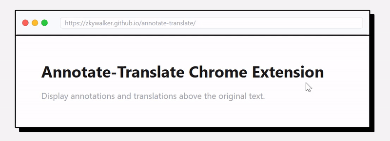

# Annotate Translate


一个功能丰富的 Chrome 浏览器扩展，支持网页文本翻译、标注和词汇学习。

> A vibe coding project



## 核心功能

- **多提供商支持** - Google、有道、DeepL、AI 翻译
- **AI 驱动翻译** - OpenAI 兼容接口，上下文感知
- **智能标注** - 自动标注音标和翻译，永久保存
- **音频播放** - 支持发音朗读，多种音频源
- **词汇模式** - 批量标注词库单词，支持 CET、TOEFL、GRE

## 支持的翻译提供商

- **Google Translate** - 免费，无需配置
- **有道翻译** - 需要 API Key，中文优化
- **DeepL** - 需要 API Key，高质量翻译
- **AI 翻译** - 支持 OpenAI 兼容接口

## 安装

1. 克隆仓库
   ```bash
   git clone https://github.com/zkywalker/annotate-translate.git
   ```

2. 打开 Chrome 浏览器 `chrome://extensions/`，开启"开发者模式"

3. 点击"加载已解压的扩展程序"，选择项目目录

## 开发

详见 [开发文档](docs/development/getting-started.md)

## 许可证

MIT License - 详见 [LICENSE](LICENSE) 文件
