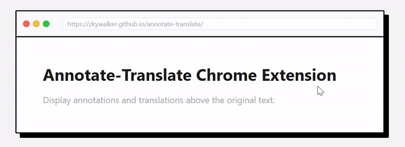

# Annotate Translate


一个功能丰富的 Chrome 浏览器扩展，支持网页文本翻译、标注和词汇学习。

> A vibe coding project



## 核心功能

- **多提供商支持** - Google、有道、DeepL、AI 翻译
- **AI 驱动翻译** - OpenAI 兼容接口，上下文感知
- **智能标注** - 自动标注音标和翻译，永久保存
- **音频播放** - 支持发音朗读，多种音频源
- **词汇模式** - 批量标注词库单词，支持 CET、TOEFL、GRE

## 支持的翻译提供商

- **Google Translate** - 免费，无需配置
- **有道翻译** - 需要 API Key，中文优化
- **DeepL** - 需要 API Key，高质量翻译
- **AI 翻译** - 支持 OpenAI 兼容接口，自动提取选中文本的上下文语境，实现更精准的翻译

## 安装

### 从 Release 安装

1. 在 [GitHub Releases](https://github.com/zkywalker/annotate-translate/releases) 下载最新的 `annotate-translate-<version>.zip`
2. 始终解压并覆盖到同一个本地目录
3. 打开 Chrome 的 `chrome://extensions/`，开启“开发者模式”
4. 首次安装时点击“加载已解压的扩展程序”并选择该目录；后续覆盖文件后点击扩展卡片上的刷新按钮

> Chrome 不能直接加载 zip，需要先解压。Release 同时提供 `.sha256` 文件用于校验下载内容。`v0.1.1` 首次引入固定扩展 ID，从 `v0.1.0` 升级时可能需要移除旧扩展并重新加载一次；此后的正式版本可以稳定覆盖升级。

### 从源码安装

1. 克隆仓库
   ```bash
   git clone https://github.com/zkywalker/annotate-translate.git
   ```

2. 打开 Chrome 浏览器 `chrome://extensions/`，开启"开发者模式"

3. 点击"加载已解压的扩展程序"，选择项目目录

## 开发

详见 [开发文档](docs/development/getting-started.md)

### 构建包

项目不需要安装 npm 依赖，要求 Node.js 20+ 和系统 `zip` 命令：

```bash
# 正式包：正式名称、关闭 logger 调试输出
npm run build:release

# 预览包：名称带 [Preview]、包含提交标识、打开 logger 调试输出
npm run build:preview -- --commit "$(git rev-parse HEAD)"
```

产物位于 `dist/`。正式包固定输出到 `dist/annotate-translate/`，preview 固定输出到 `dist/annotate-translate-preview/`，可直接通过“加载已解压的扩展程序”使用；带版本号的 zip 用于 GitHub Actions 分发。

正式包和 preview 包分别使用稳定且不同的扩展 ID：正式版本之间可以覆盖升级，preview 版本之间也可以覆盖升级，两者还可以同时安装。zip 文件名中的版本或提交号只用于辨识产物，不决定扩展身份。

GitHub Actions 会为每次分支 push 和 Pull Request 构建 preview 包，也支持手动选择 preview/release。推送与 `manifest.json` 版本一致的标签（例如 `v0.1.1`）时，会自动创建 GitHub Release 并上传正式 zip 与 SHA-256 校验文件。

## 许可证

MIT License - 详见 [LICENSE](LICENSE) 文件
