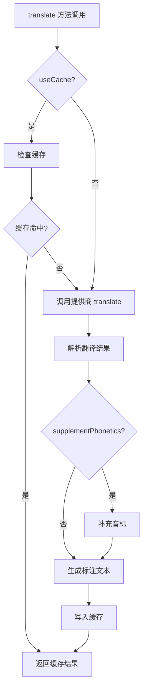

# TranslationService API

`TranslationService` 是翻译功能的核心服务类，负责管理翻译提供商、缓存翻译结果、补充音标等功能。

## 类概览

```javascript
class TranslationService {
  constructor()

  // 提供商管理
  registerProvider(name, provider)
  setActiveProvider(name)
  getActiveProvider()

  // 翻译功能
  async translate(text, targetLang, sourceLang = 'auto', options = {})
  async detectLanguage(text)
  getSupportedLanguages()

  // 音标处理
  async supplementPhonetics(result, text, sourceLang)

  // 标注文本生成
  generateAnnotationText(result, options = {})

  // 缓存管理
  getFromCache(key)
  setToCache(key, result)
  clearCache()
  getCacheKey(text, sourceLang, targetLang, provider)
}
```

## 全局实例

```javascript
// src/services/translation-service.js
const translationService = new TranslationService();

// 预注册所有提供商
translationService.registerProvider('google', new GoogleTranslateProvider());
translationService.registerProvider('youdao', new YoudaoTranslateProvider());
translationService.registerProvider('deepl', new DeepLTranslateProvider());
translationService.registerProvider('openai', new OpenAITranslateProvider());
translationService.registerProvider('freedictionary', new FreeDictionaryProvider());
```

::: tip 全局单例
`translationService` 是全局单例实例，在 Content Script 中直接使用，无需手动实例化。
:::

---

## 构造函数

### `new TranslationService()`

创建 TranslationService 实例。

**参数**: 无

**示例**:

```javascript
const service = new TranslationService();
```

**属性初始化**:

```javascript
{
  providers: new Map(),           // 提供商映射
  activeProvider: null,           // 当前活动提供商名称
  cache: new Map(),               // 翻译结果缓存
  cacheMaxSize: 100,              // 缓存最大条目数
  cacheTTL: 3600000,              // 缓存 TTL (1 小时)
  freeDictionaryProvider: new FreeDictionaryProvider()  // 音标补充提供商
}
```

---

## 提供商管理

### `registerProvider(name, provider)`

注册翻译提供商。

**参数**:

| 参数 | 类型 | 必需 | 说明 |
|-----|------|-----|------|
| `name` | `string` | ✅ | 提供商名称 (如 `'google'`, `'youdao'`) |
| `provider` | `TranslationProvider` | ✅ | 提供商实例 (必须继承 `TranslationProvider`) |

**返回值**: `void`

**异常**:
- 如果 `provider` 不是 `TranslationProvider` 实例，抛出 `TypeError`

**示例**:

```javascript
// 注册 Google Translate 提供商
const googleProvider = new GoogleTranslateProvider();
translationService.registerProvider('google', googleProvider);

// 注册自定义提供商
class MyCustomProvider extends TranslationProvider {
  async translate(text, targetLang, sourceLang) {
    // 自定义翻译逻辑
    return { originalText: text, translatedText: '...', detectedLanguage: sourceLang };
  }
}

translationService.registerProvider('custom', new MyCustomProvider());
```

---

### `setActiveProvider(name)`

设置当前活动的翻译提供商，并清除缓存。

**参数**:

| 参数 | 类型 | 必需 | 说明 |
|-----|------|-----|------|
| `name` | `string` | ✅ | 提供商名称 (必须已注册) |

**返回值**: `void`

**异常**:
- 如果提供商未注册，抛出 `Error: Provider ${name} not found`

**副作用**:
- 清空翻译缓存 (`clearCache()`)

**示例**:

```javascript
// 切换到 Google Translate
translationService.setActiveProvider('google');

// 切换到 OpenAI
translationService.setActiveProvider('openai');

// 错误示例: 提供商未注册
translationService.setActiveProvider('unknown'); // ❌ Error: Provider unknown not found
```

---

### `getActiveProvider()`

获取当前活动的翻译提供商实例。

**参数**: 无

**返回值**: `TranslationProvider | null`

**示例**:

```javascript
const provider = translationService.getActiveProvider();

if (provider) {
  console.log(`Current provider: ${provider.name}`);
  console.log(`Supported languages:`, provider.getSupportedLanguages());
}
```

---

## 翻译功能

### `translate(text, targetLang, sourceLang = 'auto', options = {})`

翻译文本 (异步)。

**参数**:

| 参数 | 类型 | 默认值 | 说明 |
|-----|------|-------|------|
| `text` | `string` | - | 要翻译的文本 |
| `targetLang` | `string` | - | 目标语言 (ISO 639-1，如 `'zh-CN'`, `'en'`) |
| `sourceLang` | `string` | `'auto'` | 源语言 (`'auto'` 表示自动检测) |
| `options` | `object` | `{}` | 可选参数 |

**options 参数**:

| 字段 | 类型 | 说明 |
|-----|------|------|
| `context` | `string` | 上下文文本 (用于 AI 提供商) |
| `batchMode` | `boolean` | 批量翻译模式 |
| `useCache` | `boolean` | 是否使用缓存 (默认 `true`) |
| `supplementPhonetics` | `boolean` | 是否补充音标 (默认 `true`) |

**返回值**: `Promise<TranslationResult>`

```typescript
interface TranslationResult {
  originalText: string;           // 原文
  translatedText: string;         // 译文
  detectedLanguage: string;       // 检测到的源语言
  phonetics?: PhoneticInfo[];     // 音标列表
  definitions?: Definition[];     // 释义列表
  examples?: Example[];           // 例句列表
  audio?: ArrayBuffer;            // 音频数据
  audioUrl?: string;              // 音频 URL
  provider?: string;              // 提供商名称
  timestamp?: number;             // 翻译时间戳
  metadata?: object;              // 提供商特定数据
}
```

**异常**:
- 如果翻译失败，抛出 `Error` (包含错误消息)

**示例**:

```javascript
// 基本用法: 翻译英文到中文
const result = await translationService.translate('hello', 'zh-CN');
console.log(result.translatedText); // "你好"

// 指定源语言
const result2 = await translationService.translate('bonjour', 'en', 'fr');
console.log(result2.translatedText); // "hello"

// 使用上下文 (AI 提供商)
const result3 = await translationService.translate(
  'bank',
  'zh-CN',
  'en',
  { context: 'I went to the bank to withdraw money' }
);
console.log(result3.translatedText); // "银行" (而非 "河岸")

// 禁用缓存
const result4 = await translationService.translate(
  'hello',
  'zh-CN',
  'auto',
  { useCache: false }
);

// 批量翻译
const result5 = await translationService.translate(
  'apple,banana,orange',
  'zh-CN',
  'en',
  { batchMode: true }
);
```

**翻译流程**:



---

### `detectLanguage(text)`

检测文本语言 (异步)。

**参数**:

| 参数 | 类型 | 必需 | 说明 |
|-----|------|-----|------|
| `text` | `string` | ✅ | 要检测的文本 |

**返回值**: `Promise<string>` - ISO 639-1 语言代码 (如 `'en'`, `'zh'`)

**异常**:
- 如果检测失败，抛出 `Error`

**示例**:

```javascript
const lang1 = await translationService.detectLanguage('Hello world');
console.log(lang1); // "en"

const lang2 = await translationService.detectLanguage('你好世界');
console.log(lang2); // "zh"

const lang3 = await translationService.detectLanguage('Bonjour le monde');
console.log(lang3); // "fr"
```

---

### `getSupportedLanguages()`

获取当前提供商支持的语言列表。

**参数**: 无

**返回值**: `Array<LanguageInfo>` 或 `null`

```typescript
interface LanguageInfo {
  code: string;    // 语言代码 (如 'en', 'zh-CN')
  name: string;    // 语言名称 (如 'English', '中文')
}
```

**示例**:

```javascript
const languages = translationService.getSupportedLanguages();

if (languages) {
  console.log('Supported languages:');
  languages.forEach(lang => {
    console.log(`${lang.code}: ${lang.name}`);
  });
}

// 输出示例:
// en: English
// zh-CN: 简体中文
// fr: Français
// de: Deutsch
```

---

## 音标处理

### `supplementPhonetics(result, text, sourceLang)`

补充翻译结果的音标信息 (异步)。

**参数**:

| 参数 | 类型 | 必需 | 说明 |
|-----|------|-----|------|
| `result` | `TranslationResult` | ✅ | 翻译结果对象 (会被修改) |
| `text` | `string` | ✅ | 原文文本 |
| `sourceLang` | `string` | ✅ | 源语言 |

**返回值**: `Promise<TranslationResult>` - 修改后的 `result` 对象

**补充策略** (三层 Fallback):

1. **提供商音标**: 如果 `result.phonetics` 已存在，直接返回
2. **FreeDictionary API**: 查询 FreeDictionary API 获取英文单词音标
3. **本地 ECDICT**: (未来实现) 查询本地词典

**示例**:

```javascript
// 获取翻译结果 (可能没有音标)
const result = await googleProvider.translate('hello', 'zh-CN', 'en');
console.log(result.phonetics); // undefined

// 补充音标
await translationService.supplementPhonetics(result, 'hello', 'en');
console.log(result.phonetics); // [{ text: "/həˈloʊ/", type: "us", audioUrl: "..." }]
```

**注意**:
- ✅ 仅对英文 (`sourceLang === 'en'` 或 `'auto'`) 补充音标
- ✅ 如果提供商已返回音标，不会重复查询
- ✅ FreeDictionary 查询失败不会抛出异常，静默失败

---

## 标注文本生成

### `generateAnnotationText(result, options = {})`

根据翻译结果生成标注文本 (用于 `<ruby>` 标签)。

**参数**:

| 参数 | 类型 | 必需 | 说明 |
|-----|------|-----|------|
| `result` | `TranslationResult` | ✅ | 翻译结果对象 |
| `options` | `object` | - | 可选参数 |

**options 参数**:

| 字段 | 类型 | 默认值 | 说明 |
|-----|------|-------|------|
| `showPhonetics` | `boolean` | `true` | 显示音标 |
| `showTranslation` | `boolean` | `true` | 显示翻译 |
| `showDefinitions` | `boolean` | `false` | 显示释义 (仅第一条) |

**返回值**: `string` - 标注文本

**格式**:
- 仅音标: `"/həˈloʊ/"`
- 仅翻译: `"你好"`
- 音标 + 翻译: `"/həˈloʊ/ 你好"`
- 全部: `"/həˈloʊ/ 你好 (int. 喂，你好)"`

**示例**:

```javascript
const result = {
  originalText: 'hello',
  translatedText: '你好',
  phonetics: [{ text: '/həˈloʊ/', type: 'us' }],
  definitions: [
    { type: 'int.', text: '喂，你好' },
    { type: 'n.', text: '招呼，问候' }
  ]
};

// 默认: 音标 + 翻译
const text1 = translationService.generateAnnotationText(result);
console.log(text1); // "/həˈloʊ/ 你好"

// 仅翻译
const text2 = translationService.generateAnnotationText(result, {
  showPhonetics: false,
  showTranslation: true
});
console.log(text2); // "你好"

// 全部信息
const text3 = translationService.generateAnnotationText(result, {
  showPhonetics: true,
  showTranslation: true,
  showDefinitions: true
});
console.log(text3); // "/həˈloʊ/ 你好 (int. 喂，你好)"
```

---

## 缓存管理

### `getFromCache(key)`

从缓存中获取翻译结果。

**参数**:

| 参数 | 类型 | 必需 | 说明 |
|-----|------|-----|------|
| `key` | `string` | ✅ | 缓存键 (通过 `getCacheKey()` 生成) |

**返回值**: `TranslationResult | null`

**TTL 检查**: 如果缓存条目超过 TTL (1 小时)，自动删除并返回 `null`

**示例**:

```javascript
const key = translationService.getCacheKey('hello', 'en', 'zh-CN', 'google');
const cached = translationService.getFromCache(key);

if (cached) {
  console.log('Cache hit:', cached.translatedText);
} else {
  console.log('Cache miss');
}
```

---

### `setToCache(key, result)`

将翻译结果写入缓存。

**参数**:

| 参数 | 类型 | 必需 | 说明 |
|-----|------|-----|------|
| `key` | `string` | ✅ | 缓存键 |
| `result` | `TranslationResult` | ✅ | 翻译结果对象 |

**返回值**: `void`

**LRU 淘汰**: 如果缓存已满 (`size >= cacheMaxSize`)，删除访问次数最少的条目。

**示例**:

```javascript
const key = translationService.getCacheKey('hello', 'en', 'zh-CN', 'google');
const result = { originalText: 'hello', translatedText: '你好', detectedLanguage: 'en' };

translationService.setToCache(key, result);
console.log('Cached:', key);
```

---

### `clearCache()`

清空所有缓存条目。

**参数**: 无

**返回值**: `void`

**示例**:

```javascript
// 切换提供商时清除缓存
translationService.setActiveProvider('openai'); // 内部调用 clearCache()

// 手动清除缓存
translationService.clearCache();
console.log('Cache cleared');
```

---

### `getCacheKey(text, sourceLang, targetLang, provider)`

生成缓存键。

**参数**:

| 参数 | 类型 | 必需 | 说明 |
|-----|------|-----|------|
| `text` | `string` | ✅ | 原文文本 |
| `sourceLang` | `string` | ✅ | 源语言 |
| `targetLang` | `string` | ✅ | 目标语言 |
| `provider` | `string` | ✅ | 提供商名称 |

**返回值**: `string` - 格式: `"${text}:${sourceLang}:${targetLang}:${provider}"`

**示例**:

```javascript
const key = translationService.getCacheKey('hello', 'en', 'zh-CN', 'google');
console.log(key); // "hello:en:zh-CN:google"

// 不同提供商的缓存键不同
const key2 = translationService.getCacheKey('hello', 'en', 'zh-CN', 'openai');
console.log(key2); // "hello:en:zh-CN:openai"
```

---

## 错误处理

### 常见错误

| 错误类型 | 触发条件 | 解决方法 |
|---------|---------|---------|
| `Provider ${name} not found` | 调用未注册的提供商 | 检查提供商是否已注册 |
| `API key required` | 提供商需要 API Key 但未配置 | 在设置中配置 API Key |
| `Network error` | 网络请求失败 | 检查网络连接 |
| `CORS error` | 跨域请求被阻止 | 确保使用 Background 代理 |
| `Rate limit exceeded` | API 速率限制 | 等待后重试，或切换提供商 |

### 错误处理示例

```javascript
try {
  const result = await translationService.translate('hello', 'zh-CN');
  console.log(result.translatedText);
} catch (error) {
  console.error('Translation failed:', error.message);

  // 根据错误类型处理
  if (error.message.includes('API key')) {
    alert('请在设置中配置 API Key');
  } else if (error.message.includes('Rate limit')) {
    alert('API 请求过于频繁，请稍后重试');
  } else if (error.message.includes('Network')) {
    alert('网络连接失败，请检查网络');
  } else {
    alert('翻译失败: ' + error.message);
  }
}
```

---

## 最佳实践

### 1. 合理使用缓存

```javascript
// ✅ 默认启用缓存 (推荐)
const result = await translationService.translate('hello', 'zh-CN');

// ⚠️ 禁用缓存 (仅特殊场景，如实时更新的内容)
const result2 = await translationService.translate(
  'hello',
  'zh-CN',
  'auto',
  { useCache: false }
);
```

### 2. 处理音标补充

```javascript
// ✅ 自动补充音标 (默认)
const result = await translationService.translate('hello', 'zh-CN', 'en');
// result.phonetics 可能来自 Google 或 FreeDictionary

// ⚠️ 禁用音标补充 (性能优化场景)
const result2 = await translationService.translate(
  'hello',
  'zh-CN',
  'en',
  { supplementPhonetics: false }
);
```

### 3. 优雅降级

```javascript
async function translateWithFallback(text, targetLang) {
  try {
    // 尝试主提供商
    return await translationService.translate(text, targetLang);
  } catch (error) {
    console.warn('Primary translation failed, fallback to Google');

    // 降级到 Google
    const previousProvider = translationService.activeProvider;
    translationService.setActiveProvider('google');

    try {
      return await translationService.translate(text, targetLang);
    } finally {
      // 恢复原提供商
      translationService.setActiveProvider(previousProvider);
    }
  }
}
```

### 4. 批量翻译优化

```javascript
// ❌ 低效: 逐个翻译
async function translateWords(words) {
  const results = [];
  for (const word of words) {
    results.push(await translationService.translate(word, 'zh-CN'));
  }
  return results;
}

// ✅ 高效: 批量翻译 (如果提供商支持)
async function translateWordsBatch(words) {
  const text = words.join(', ');
  return await translationService.translate(text, 'zh-CN', 'auto', {
    batchMode: true
  });
}
```

### 5. 监控缓存效率

```javascript
let cacheHits = 0;
let cacheMisses = 0;

async function translateWithStats(text, targetLang) {
  const key = translationService.getCacheKey(
    text,
    'auto',
    targetLang,
    translationService.activeProvider
  );

  if (translationService.getFromCache(key)) {
    cacheHits++;
  } else {
    cacheMisses++;
  }

  const result = await translationService.translate(text, targetLang);

  console.log(`Cache hit rate: ${(cacheHits / (cacheHits + cacheMisses) * 100).toFixed(1)}%`);

  return result;
}
```

---

## 相关文档

- [翻译服务详解](/development/translation-service) - 服务层设计与实现
- [提供商系统](/development/providers) - Provider Pattern 架构
- [核心概念](/development/core-concepts) - 设计模式与数据流
- [提供商 API](/api/providers/base-provider) - TranslationProvider 基类 API
