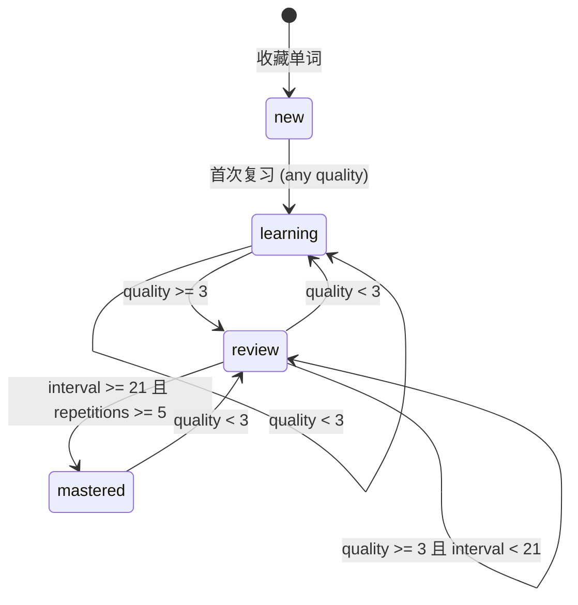

<!-- DD-DOC-META
Design spec & review artifact for Wordbook data model and SM-2 algorithm.
- Agent: implement strictly from this spec. Do not add unspecified features.
- Engineer: review this doc to validate design intent and expose flaws.
- Code-spec conflict: this spec is authoritative. Fix code or get approval to update spec.
-->

# 数据模型与 SM-2 算法

::: tip TL;DR
单词本使用 chrome.storage.local 存储，key 为 `wordbook`。每个单词条目包含翻译数据和 SM-2 复习调度参数。分组为扁平 tag 系统。SM-2 算法按质量评分（0-5）动态调整复习间隔和难度因子。
:::

## 存储结构

**Storage Key**: `wordbook`

```javascript
{
  wordbook: {
    version: 1,                    // 数据版本，用于未来迁移
    entries: { [id]: WordEntry },  // 以 id 为 key 的 map，O(1) 查找
    groups: [GroupMeta],           // 分组定义
    stats: GlobalStats             // 全局统计
  }
}
```

## WordEntry

| Field | Type | Constraint | Default | Description |
|-------|------|------------|---------|-------------|
| id | string | PK, unique | `${timestamp}_${random4}` | 唯一标识 |
| word | string | NOT NULL, indexed | — | 原文（用作去重 key） |
| translation | string | NOT NULL | — | 主翻译文本 |
| phonetics | `Phonetic[]` | — | `[]` | 音标数组，复用 TranslationResult 格式 |
| definitions | `Definition[]` | — | `[]` | 词义数组 |
| examples | `Example[]` | — | `[]` | 例句数组（最多保存 3 条） |
| sourceLang | string | — | `'auto'` | 源语言 |
| targetLang | string | NOT NULL | — | 目标语言 |
| context | string | max 200 chars | `''` | 收藏时的上下文句子 |
| sourceUrl | string | — | `''` | 收藏时的页面 URL |
| groups | `string[]` | — | `['default']` | 所属分组 tag 列表 |
| createdAt | number | NOT NULL | `Date.now()` | 收藏时间戳 |
| review | ReviewState | NOT NULL | see below | SM-2 复习状态 |

## ReviewState（SM-2 参数）

| Field | Type | Constraint | Default | Description |
|-------|------|------------|---------|-------------|
| repetitions | number | >= 0 | `0` | 连续正确次数 |
| easeFactor | number | >= 1.3 | `2.5` | 难度因子（EF） |
| interval | number | >= 0 | `0` | 当前复习间隔（天） |
| nextReviewAt | number | — | `Date.now()` | 下次复习时间戳 |
| lastReviewAt | number | — | `0` | 上次复习时间戳 |
| totalReviews | number | >= 0 | `0` | 总复习次数 |
| correctCount | number | >= 0 | `0` | 正确次数（quality >= 3） |
| status | enum | NOT NULL | `'new'` | `'new'` / `'learning'` / `'review'` / `'mastered'` |

## GroupMeta

| Field | Type | Constraint | Default | Description |
|-------|------|------------|---------|-------------|
| id | string | PK | — | 分组 ID |
| name | string | NOT NULL, max 30 chars | — | 分组名称 |
| color | string | hex color | `'#6b7280'` | 分组标签颜色 |
| createdAt | number | — | `Date.now()` | 创建时间 |

**预置分组**:
- `{ id: 'default', name: 'Default', color: '#6b7280' }` — 禁止删除

## GlobalStats

| Field | Type | Default | Description |
|-------|------|---------|-------------|
| totalCollected | number | `0` | 累计收藏数 |
| totalReviews | number | `0` | 累计复习次数 |
| streakDays | number | `0` | 连续复习天数 |
| lastStudyDate | string | `''` | 上次学习日期 `YYYY-MM-DD` |
| dailyHistory | `{ [date]: DayStats }` | `{}` | 按天统计，保留最近 90 天 |

### DayStats

| Field | Type | Description |
|-------|------|-------------|
| reviewed | number | 当天复习单词数 |
| correct | number | 当天正确数 |
| newWords | number | 当天新收藏数 |

## SM-2 算法

### 质量评分（Quality Rating）

| Score | Label | 含义 | UI 操作 |
|-------|-------|------|---------|
| 0 | Blackout | 完全不记得 | — (不在 UI 中直接使用) |
| 1 | Wrong | 看到答案后仍觉得陌生 | "不认识" 按钮 |
| 2 | Hard | 勉强记起但很困难 | — (不在 UI 中直接使用) |
| 3 | OK | 有困难但答对了 | "困难" 按钮 |
| 4 | Good | 较轻松地答对 | "记住了" 按钮 |
| 5 | Easy | 毫不费力 | "简单" 按钮 |

::: warning UI 简化
UI 仅呈现 3 个按钮：**不认识 (q=1)**, **困难 (q=3)**, **记住了 (q=4)**。用户无需理解底层 0-5 分制。当用户连续 3 次对同一单词评分 4 或 5 时，额外显示 "太简单了" (q=5) 按钮。
:::

### 核心算法

```javascript
function sm2(reviewState, quality) {
  let { repetitions, easeFactor, interval } = reviewState;

  if (quality < 3) {
    // 答错：重置
    repetitions = 0;
    interval = 0;
  } else {
    // 答对：递增
    if (repetitions === 0) {
      interval = 1;       // 第一次：1 天后
    } else if (repetitions === 1) {
      interval = 3;       // 第二次：3 天后
    } else {
      interval = Math.round(interval * easeFactor);
    }
    repetitions += 1;
  }

  // 更新难度因子
  easeFactor = easeFactor + (0.1 - (5 - quality) * (0.08 + (5 - quality) * 0.02));
  if (easeFactor < 1.3) easeFactor = 1.3;

  // 状态判定
  let status;
  if (repetitions === 0) {
    status = 'learning';
  } else if (interval >= 21 && repetitions >= 5) {
    status = 'mastered';
  } else {
    status = 'review';
  }

  return {
    repetitions,
    easeFactor: Math.round(easeFactor * 100) / 100,
    interval,
    nextReviewAt: Date.now() + interval * 24 * 60 * 60 * 1000,
    lastReviewAt: Date.now(),
    totalReviews: reviewState.totalReviews + 1,
    correctCount: quality >= 3 ? reviewState.correctCount + 1 : reviewState.correctCount,
    status
  };
}
```

### 状态机



| From | To | Trigger | Guard | Side Effect |
|------|----|---------|-------|-------------|
| new | learning | 首次复习 | — | interval 设为 0 或 1 |
| learning | learning | 复习 | quality < 3 | repetitions 重置为 0 |
| learning | review | 复习 | quality >= 3 | interval 按 SM-2 计算 |
| review | learning | 复习 | quality < 3 | repetitions 重置为 0 |
| review | mastered | 复习 | quality >= 3, interval >= 21, repetitions >= 5 | — |
| mastered | review | 复习 | quality < 3 | repetitions 重置为 0 |

## Business Rules

- **BR-001**: WHEN 用户收藏已存在的单词（word + targetLang 相同） THEN 更新翻译数据但保留 ReviewState 不变
- **BR-002**: WHEN entries 数量达到 5000 THEN 阻止新增并提示用户删除已掌握的单词
- **BR-003**: WHEN dailyHistory 条目超过 90 天 THEN 自动清理最早的记录
- **BR-004**: WHEN 用户删除分组 THEN 该分组下的单词自动移入 default 分组，不删除单词
- **BR-005**: WHEN 单词的所有分组均被删除 THEN 自动添加 default 分组
- **BR-006**: WHEN 数据版本号不匹配 THEN 执行迁移逻辑将旧数据转换为新格式
