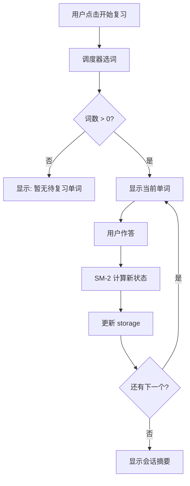

<!-- DD-DOC-META
Design spec & review artifact for review system and modes.
- Agent: implement strictly from this spec. Do not add unspecified features.
- Engineer: review this doc to validate design intent and expose flaws.
- Code-spec conflict: this spec is authoritative. Fix code or get approval to update spec.
-->

# 复习系统

::: tip TL;DR
复习入口位于 Options 页面和 Popup 中。调度器按 SM-2 的 nextReviewAt 选取到期单词，优先级为：过期 > learning > new。三种复习模式：闪卡翻转（默认）、四选一选择题、拼写输入。每次 session 结束显示本轮摘要。
:::

## 复习入口

### Popup 入口

```
┌─ Annotate Translate ──────────┐
│  ...existing toggles...       │
│  ───────────────────────────  │
│  📖 待复习: 12 个              │  ← 新增行，点击打开 Options 复习 Tab
│  [开始复习]                    │
└───────────────────────────────┘
```

- WHEN 待复习数 = 0 THEN 显示 "今日已完成 ✓"，按钮置灰
- 待复习数 = entries WHERE `nextReviewAt <= Date.now()` AND `status != 'mastered'`

### Options 页面入口

在 Options 页面新增 "复习" Tab，与 "设置"、"单词本" 并列。

## 复习调度器（Scheduler）

### 选词逻辑

```javascript
function selectReviewWords(entries, sessionSize = 20) {
  const now = Date.now();

  // 1. 过期词（已到复习时间）
  const overdue = entries.filter(e =>
    e.review.nextReviewAt <= now && e.review.status !== 'mastered'
  );

  // 2. 按优先级排序：过期越久越优先
  overdue.sort((a, b) => a.review.nextReviewAt - b.review.nextReviewAt);

  // 3. 如果过期词不足 sessionSize，补充 new 状态的词
  const selected = overdue.slice(0, sessionSize);
  if (selected.length < sessionSize) {
    const newWords = entries.filter(e => e.review.status === 'new');
    newWords.sort((a, b) => a.createdAt - b.createdAt); // 先收藏的先学
    selected.push(...newWords.slice(0, sessionSize - selected.length));
  }

  return selected;
}
```

### 会话配置

| 参数 | 类型 | 默认 | 范围 | 描述 |
|------|------|------|------|------|
| sessionSize | number | `20` | 5-50 | 每次复习单词数 |
| reviewMode | enum | `'flashcard'` | `'flashcard'` / `'quiz'` / `'spelling'` | 复习模式 |
| autoPlayAudio | boolean | `false` | — | 自动播放发音 |
| showContext | boolean | `true` | — | 显示收藏时的上下文 |

## 复习模式

### Mode 1: 闪卡翻转（Flashcard）

```
正面（初始显示）:
┌──────────────────────────────────┐
│           ephemeral              │
│          /ɪˈfemərəl/  🔊        │
│                                  │
│  context: "an ephemeral moment"  │  ← showContext=true 时显示
│                                  │
│         [ 显示答案 ]             │
│                                  │
│              3 / 20              │  ← 进度
└──────────────────────────────────┘

反面（点击后）:
┌──────────────────────────────────┐
│           ephemeral              │
│          /ɪˈfemərəl/  🔊        │
│                                  │
│         adj. 短暂的               │
│  lasting for a very short time   │
│                                  │
│  [不认识]   [困难]   [记住了]    │
│                                  │
│              3 / 20              │
└──────────────────────────────────┘
```

**交互流程**:
1. 显示正面（原文 + 音标）
2. 用户点击 "显示答案" 或按空格键
3. 显示反面（翻译 + 释义）
4. 用户点击质量评分按钮
5. 调用 `sm2(reviewState, quality)` 更新
6. 进入下一个单词

### Mode 2: 四选一选择题（Quiz）

```
┌──────────────────────────────────┐
│        ephemeral 的意思是？       │
│          /ɪˈfemərəl/  🔊        │
│                                  │
│   A. 永恒的                      │
│   B. 短暂的          ← 正确      │
│   C. 明亮的                      │
│   D. 巨大的                      │
│                                  │
│              3 / 20              │
└──────────────────────────────────┘
```

**选项生成规则**:
- 正确选项 = 当前单词的 translation
- 3 个干扰项从 wordbook 中随机选取其他单词的 translation
- WHEN wordbook 单词不足 4 个 THEN 回退到闪卡模式
- 干扰项必须与正确答案字数相近（±50%），避免明显排除

**评分映射**:
| 结果 | Quality |
|------|---------|
| 选对 | 4 (Good) |
| 选错 | 1 (Wrong) |

### Mode 3: 拼写输入（Spelling）

```
┌──────────────────────────────────┐
│        "短暂的" 用英语怎么说？    │
│                                  │
│   [____________]    [提交]       │
│                                  │
│   💡 提示: e _ _ _ _ _ _ _ l     │  ← 可选提示
│                                  │
│              3 / 20              │
└──────────────────────────────────┘
```

**交互规则**:
- 输入后按 Enter 或点击提交
- 匹配规则: `input.trim().toLowerCase() === word.toLowerCase()`
- 提示按钮: 显示首字母、尾字母和总长度
- WHEN 输入错误 THEN 显示正确答案，quality = 1
- WHEN 使用了提示后答对 THEN quality = 3
- WHEN 未使用提示直接答对 THEN quality = 4

## 复习会话流程



### 会话摘要

复习结束后显示：

```
┌──────────────────────────────────┐
│        本次复习完成！             │
│                                  │
│   复习单词:  20                   │
│   正确率:    75%  (15/20)        │
│   新学习:    5                    │
│   已掌握:    3   ← 本轮新晋      │
│                                  │
│   [再来一轮]     [返回单词本]     │
└──────────────────────────────────┘
```

## 快捷键

| 按键 | 闪卡模式 | 选择题模式 | 拼写模式 |
|------|---------|-----------|---------|
| Space | 翻转卡片 | — | — |
| 1 | 不认识 | 选 A | — |
| 2 | 困难 | 选 B | — |
| 3 | 记住了 | 选 C | — |
| 4 | — | 选 D | — |
| Enter | — | — | 提交 |
| H | — | — | 显示提示 |

## Business Rules

- **BR-011**: WHEN 复习会话进行中用户关闭页面 THEN 已作答的结果保留（逐条保存），未作答的保持原状
- **BR-012**: WHEN 同一单词答错 THEN 在本轮 session 末尾重新出现一次（最多重复 1 次）
- **BR-013**: WHEN 复习完成 THEN 更新 GlobalStats（streakDays, dailyHistory, totalReviews）
- **BR-014**: WHEN 用户切换复习模式 THEN 立即生效，不重置当前 session 进度
