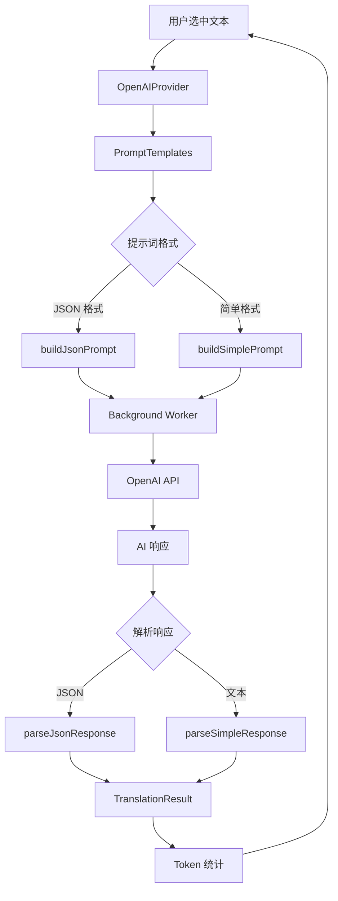

# AI 翻译

AI 翻译是 Annotate Translate 的高级特性，通过 OpenAI 兼容 API 提供上下文感知的智能翻译，特别适合专业术语和技术文档。

## 特性

- ✅ **上下文感知** - 根据上下文理解词义
- ✅ **专业术语** - 处理领域特定术语
- ✅ **自定义提示词** - 灵活的提示词模板系统
- ✅ **OpenAI 兼容** - 支持任何 OpenAI 兼容 API
- ✅ **Token 统计** - 实时统计消耗和成本
- ✅ **音标生成** - AI 生成音标和释义

## 架构



## 核心组件

### 1. OpenAIProvider

```javascript
class OpenAIProvider extends BaseAIProvider {
  constructor(config) {
    super('openai', config);

    // API 配置
    this.apiKey = config.apiKey;
    this.model = config.model || 'gpt-3.5-turbo';
    this.baseURL = config.baseURL || 'https://api.openai.com/v1';
    this.temperature = config.temperature ?? 0.3;
    this.maxTokens = config.maxTokens || 500;

    // 提示词配置
    this.promptFormat = config.promptFormat || 'jsonFormat';
    this.useContext = config.useContext ?? true;

    // 端点
    this.apiEndpoint = `${this.baseURL}/chat/completions`;
  }

  async translate(text, sourceLang, targetLang, options = {}) {
    // 1. 构建提示词
    const prompts = PromptTemplates.buildPrompt({
      text,
      sourceLang,
      targetLang,
      format: this.promptFormat,
      context: this.useContext ? (options.context || '') : ''
    });

    // 2. 调用 OpenAI API
    const response = await this.callOpenAI(prompts);

    // 3. 解析响应
    const result = this.parseResponse(response);

    // 4. 添加元数据
    result.metadata = this.calculateMetadata(response.usage);

    return result;
  }

  async callOpenAI(prompts) {
    const response = await this.sendRequestViaBackground({
      url: this.apiEndpoint,
      method: 'POST',
      headers: {
        'Authorization': `Bearer ${this.apiKey}`,
        'Content-Type': 'application/json'
      },
      body: JSON.stringify({
        model: this.model,
        messages: [
          { role: 'system', content: prompts.system },
          { role: 'user', content: prompts.user }
        ],
        temperature: this.temperature,
        max_tokens: this.maxTokens
      })
    });

    return response;
  }

  calculateMetadata(usage) {
    return {
      tokensUsed: usage.total_tokens,
      promptTokens: usage.prompt_tokens,
      completionTokens: usage.completion_tokens,
      cost: this.calculateCost(usage.total_tokens)
    };
  }

  calculateCost(tokens) {
    const rates = {
      'gpt-3.5-turbo': 0.002 / 1000,
      'gpt-4': 0.03 / 1000,
      'gpt-4-turbo': 0.01 / 1000
    };
    return (rates[this.model] || 0) * tokens;
  }
}
```

### 2. PromptTemplates

提示词模板系统支持两种格式：

#### JSON 格式（推荐）

返回结构化 JSON，包含翻译、音标、释义：

```javascript
{
  "translation": "你好",
  "phonetic": "/həˈloʊ/",
  "definitions": ["(用于问候)喂，你好", "招呼，问候"]
}
```

**提示词**:

```javascript
static buildJsonPrompt({ text, sourceLang, targetLang, context }) {
  return {
    system: `你是一个专业的翻译助手。请将用户提供的${sourceLang}文本翻译成${targetLang}。

请返回 JSON 格式，包含以下字段：
{
  "translation": "翻译结果",
  "phonetic": "音标（如适用）",
  "definitions": ["释义1", "释义2"]
}

注意事项：
1. translation 必须准确、地道
2. phonetic 为源文本的音标（如 hello → /həˈloʊ/）
3. definitions 是目标语言的释义列表
4. 如果有上下文，请根据上下文选择最合适的翻译
5. 只返回 JSON，不要其他文字`,

    user: context
      ? `文本: ${text}\n上下文: ${context}`
      : `文本: ${text}`
  };
}
```

#### 简单格式

仅返回翻译文本：

```javascript
static buildSimplePrompt({ text, sourceLang, targetLang }) {
  return {
    system: `你是一个专业翻译。将${sourceLang}翻译成${targetLang}，只返回翻译结果，不要解释。`,
    user: text
  };
}
```

### 3. 上下文处理

```javascript
class PromptTemplates {
  static processContext(text, fullContext, config = {}) {
    const maxContextLength = config.maxContextLength || 200;

    // 找到文本在上下文中的位置
    const textIndex = fullContext.indexOf(text);
    if (textIndex === -1) return text;

    // 提取前后文本
    const beforeText = fullContext.substring(
      Math.max(0, textIndex - maxContextLength / 2),
      textIndex
    );
    const afterText = fullContext.substring(
      textIndex + text.length,
      Math.min(fullContext.length, textIndex + text.length + maxContextLength / 2)
    );

    // 格式化上下文
    return `${beforeText.trim()} [${text}] ${afterText.trim()}`;
  }
}
```

**使用示例**:

```
原始文本: "The chamber is designed to protect sensitive equipment from electromagnetic interference."

选中词: "chamber"

上下文: "The [chamber] is designed to protect sensitive equipment"

AI 翻译: "舱室" ✅ （而非 "房间"）
```

## 使用示例

### 基本用法

```javascript
// 1. 配置 OpenAI 提供商
const config = {
  apiKey: 'sk-...',
  model: 'gpt-3.5-turbo',
  baseURL: 'https://api.openai.com/v1',
  promptFormat: 'jsonFormat',
  useContext: true
};

const provider = new OpenAIProvider(config);
translationService.registerProvider('openai', provider);
translationService.setActiveProvider('openai');

// 2. 翻译
const result = await translationService.translate('hello', 'zh-CN', 'en');

console.log(result.translatedText);      // "你好"
console.log(result.phonetics[0].text);   // "/həˈloʊ/"
console.log(result.definitions[0].text); // "(用于问候)喂，你好"
console.log(result.metadata.tokensUsed); // 150
console.log(result.metadata.cost);       // 0.0003
```

### 上下文翻译

```javascript
const result = await translationService.translate(
  'chamber',
  'zh-CN',
  'en',
  {
    context: 'The chamber is designed to protect sensitive equipment'
  }
);

console.log(result.translatedText); // "舱室" （上下文感知）
```

### 自定义提示词

```javascript
// 扩展 PromptTemplates
PromptTemplates.buildCustomPrompt = function({ text, targetLang }) {
  return {
    system: '你是技术文档翻译专家...',
    user: `翻译技术术语: ${text}`
  };
};

// 使用自定义提示词
provider.promptFormat = 'customPrompt';
```

## 多提供商管理

支持配置多个 AI 提供商（OpenAI、Azure OpenAI、其他兼容 API）：

```javascript
// settings.providers.aiProviders
const aiProviders = [
  {
    id: 'openai-default',
    name: 'OpenAI',
    apiKey: 'sk-...',
    model: 'gpt-3.5-turbo',
    baseURL: 'https://api.openai.com/v1'
  },
  {
    id: 'azure-openai',
    name: 'Azure OpenAI',
    apiKey: '...',
    model: 'gpt-4',
    baseURL: 'https://your-resource.openai.azure.com'
  }
];

// 切换 AI 提供商
settings.providers.currentAIProvider = 'azure-openai';
```

## Token 统计

### TokenStatsService

```javascript
class TokenStatsService {
  constructor() {
    this.stats = {
      totalTokens: 0,
      totalCost: 0,
      requestCount: 0,
      byModel: {}
    };
  }

  recordUsage(model, tokens, cost) {
    this.stats.totalTokens += tokens;
    this.stats.totalCost += cost;
    this.stats.requestCount++;

    if (!this.stats.byModel[model]) {
      this.stats.byModel[model] = {
        tokens: 0,
        cost: 0,
        count: 0
      };
    }

    this.stats.byModel[model].tokens += tokens;
    this.stats.byModel[model].cost += cost;
    this.stats.byModel[model].count++;
  }

  getStats() {
    return {
      ...this.stats,
      averageTokensPerRequest: this.stats.totalTokens / this.stats.requestCount,
      averageCostPerRequest: this.stats.totalCost / this.stats.requestCount
    };
  }

  reset() {
    this.stats = {
      totalTokens: 0,
      totalCost: 0,
      requestCount: 0,
      byModel: {}
    };
  }
}

const tokenStatsService = new TokenStatsService();
```

### 使用统计

```javascript
// 记录使用
tokenStatsService.recordUsage(
  'gpt-3.5-turbo',
  result.metadata.tokensUsed,
  result.metadata.cost
);

// 查看统计
const stats = tokenStatsService.getStats();
console.log(`总计消耗: ${stats.totalTokens} tokens`);
console.log(`总计成本: $${stats.totalCost.toFixed(4)}`);
console.log(`平均每次: ${stats.averageTokensPerRequest} tokens`);
```

## 性能优化

### 1. 缓存 AI 翻译结果

AI 翻译结果也会被 TranslationService 缓存：

```javascript
// 缓存键包含上下文的哈希
const cacheKey = context
  ? `${text}:${sourceLang}:${targetLang}:openai:${hashContext(context)}`
  : `${text}:${sourceLang}:${targetLang}:openai`;
```

### 2. 控制 Token 消耗

```javascript
// 限制上下文长度
promptTemplates.config.maxContextLength = 150;

// 使用更便宜的模型
provider.model = 'gpt-3.5-turbo'; // 而非 gpt-4

// 降低 max_tokens
provider.maxTokens = 300; // 默认 500
```

### 3. 批量翻译优化

```javascript
async translateBatchWithAI(words, targetLang) {
  // 将多个词合并到一个请求
  const batchText = words.join(', ');

  const result = await provider.translate(
    batchText,
    'auto',
    targetLang,
    { batchMode: true }
  );

  return this.parseBatchResult(result, words);
}
```

## 错误处理

### 常见错误

```javascript
try {
  const result = await translationService.translate('hello', 'zh-CN');
} catch (error) {
  if (error.code === 'API_KEY_INVALID') {
    alert('OpenAI API Key 无效');
  } else if (error.code === 'RATE_LIMIT_EXCEEDED') {
    alert('API 速率限制，请稍后重试');
  } else if (error.code === 'INSUFFICIENT_QUOTA') {
    alert('API 配额不足');
  }
}
```

### 重试机制

```javascript
async translateWithRetry(text, targetLang, maxRetries = 3) {
  for (let i = 0; i < maxRetries; i++) {
    try {
      return await this.translate(text, targetLang);
    } catch (error) {
      if (error.code === 'RATE_LIMIT_EXCEEDED' && i < maxRetries - 1) {
        const delay = 1000 * Math.pow(2, i); // 指数退避
        await new Promise(r => setTimeout(r, delay));
        continue;
      }
      throw error;
    }
  }
}
```

## 最佳实践

### 1. 选择合适的模型

| 模型 | Token 成本 | 速度 | 质量 | 适用场景 |
|------|-----------|------|------|---------|
| gpt-3.5-turbo | $0.002/1K | 快 | 好 | 日常翻译 |
| gpt-4 | $0.03/1K | 慢 | 优秀 | 专业文档 |
| gpt-4-turbo | $0.01/1K | 中等 | 优秀 | 平衡选择 |

### 2. 优化提示词

```javascript
// ❌ 低效提示词
"Translate: hello"

// ✅ 高效提示词（JSON 格式）
{
  system: "你是专业翻译，返回 JSON: {translation, phonetic, definitions}",
  user: "hello"
}
```

### 3. 合理使用上下文

```javascript
// 短文本：不使用上下文
if (text.length < 10) {
  options.context = '';
}

// 长文本：使用上下文
if (text.length > 5) {
  options.context = getContext(text, 100);
}
```

## 总结

AI 翻译的优势：

- **智能理解** - 上下文感知，专业术语处理
- **灵活性** - 自定义提示词，适应不同场景
- **完整性** - AI 生成音标和释义
- **兼容性** - 支持任何 OpenAI 兼容 API

## 相关文档

- [OpenAI API 文档](/api/providers/openai)
- [自定义 AI 提示词](/recipes/ai-prompt-template)
- [提供商系统](/development/providers)
- [Token 统计](/development/token-stats)
