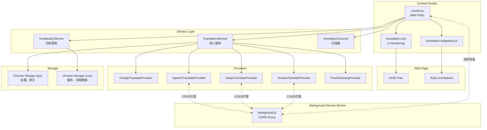
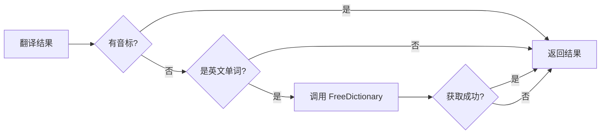
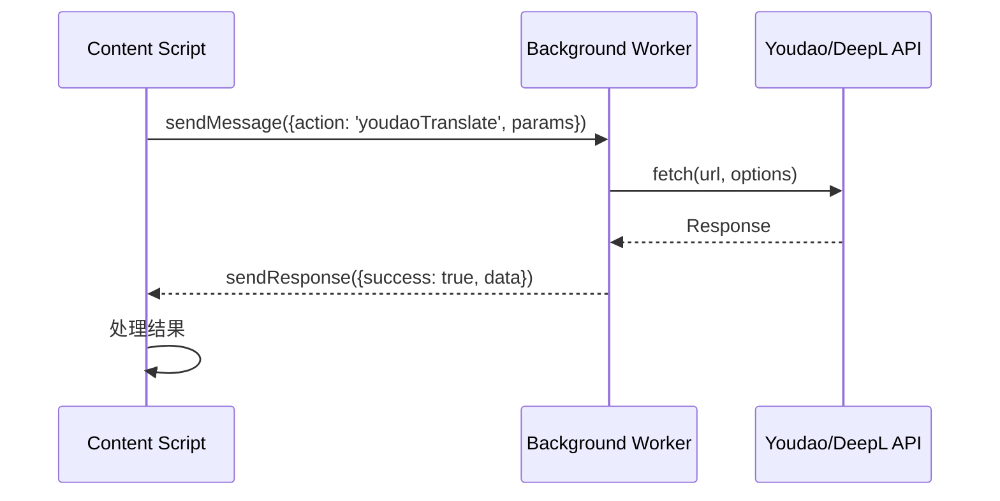
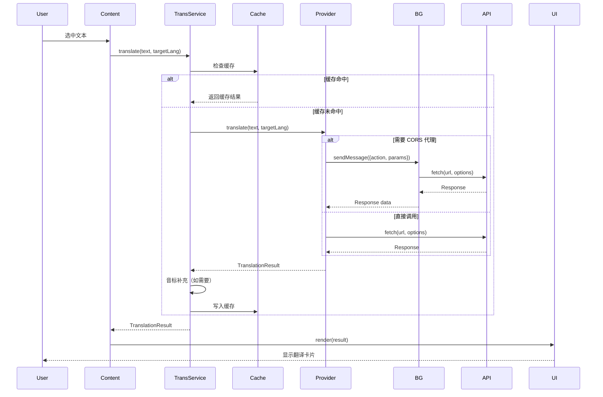
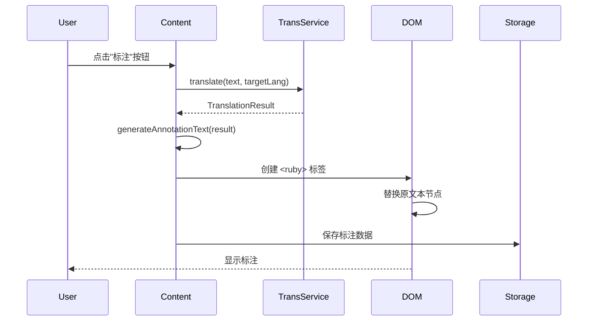
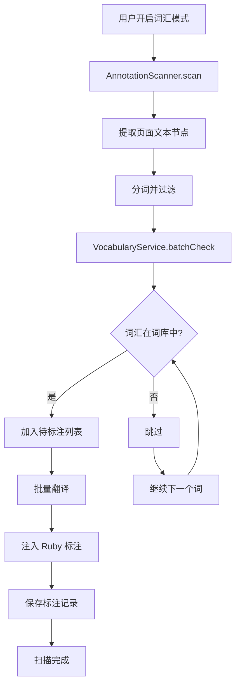
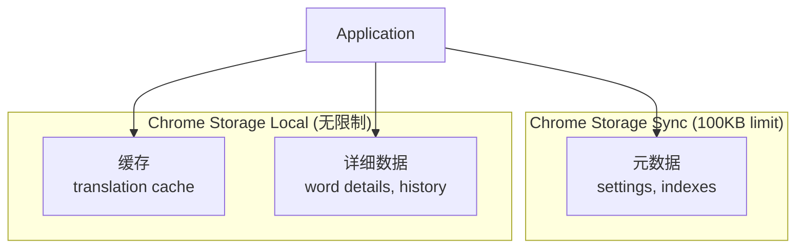

# 架构概览

本文档介绍 Annotate Translate 的整体架构设计、核心设计模式和数据流。

## 系统架构

Annotate Translate 采用分层架构，基于 Chrome Extension Manifest V3 规范。

### 三层架构



### 层级职责

#### 1. Background Service Worker

- **生命周期管理** - 扩展的后台进程
- **上下文菜单** - 右键菜单集成
- **CORS 代理** - 为 Youdao、DeepL、OpenAI 提供跨域请求代理
- **消息路由** - 处理 Content Scripts 的消息请求

#### 2. Content Scripts

- **用户交互** - 监听文本选择、点击事件
- **UI 渲染** - 显示翻译卡片、浮动菜单
- **DOM 操作** - 注入 Ruby 标注
- **状态管理** - 本地设置缓存

#### 3. Service Layer

- **业务逻辑** - 翻译、词库查询、缓存管理
- **提供商管理** - 注册、切换、配置
- **数据处理** - 音标补充、结果格式化

#### 4. Providers

- **翻译实现** - 调用具体的翻译 API
- **数据解析** - 解析 API 响应
- **错误处理** - 处理 API 错误

## 核心设计模式

### 1. Provider Pattern (提供商模式)

**目的**: 支持多个翻译服务，运行时可切换。

**实现**:

```javascript
// 抽象基类
class TranslationProvider {
  constructor(name, config) {
    this.name = name;
    this.config = config;
  }

  async translate(text, targetLang, sourceLang) {
    throw new Error('Must implement translate()');
  }

  async detectLanguage(text) {
    throw new Error('Must implement detectLanguage()');
  }
}

// 具体实现
class GoogleTranslateProvider extends TranslationProvider {
  async translate(text, targetLang, sourceLang) {
    // Google API 实现
  }
}

class YoudaoTranslateProvider extends TranslationProvider {
  async translate(text, targetLang, sourceLang) {
    // Youdao API 实现
  }
}
```

**优势**:
- ✅ 易于扩展新提供商
- ✅ 运行时切换无需重启
- ✅ 每个提供商独立配置和测试
- ✅ 符合开闭原则（对扩展开放，对修改关闭）

### 2. Singleton Pattern (单例模式)

**目的**: 全局唯一的服务实例，共享状态和缓存。

**实现**:

```javascript
// translation-service.js
class TranslationService {
  constructor() {
    this.providers = new Map();
    this.activeProvider = null;
    this.cache = new Map();
  }
  // ...
}

// 全局单例
const translationService = new TranslationService();

// content.js 中直接使用
const result = await translationService.translate(text, 'zh-CN');
```

**优势**:
- ✅ 全局状态共享
- ✅ 缓存跨调用有效
- ✅ 简化依赖管理

### 3. Fallback Pattern (降级模式)

**目的**: 提供多层备选方案，确保功能可用性。

**音标补充三层 Fallback**:



**音频播放三层 Fallback**:

```javascript
async playAudio(phonetic, text) {
  // 优先级 1: ArrayBuffer (离线音频数据)
  if (phonetic.audioData) {
    return await this.playFromArrayBuffer(phonetic.audioData);
  }

  // 优先级 2: URL (在线音频)
  if (phonetic.audioUrl) {
    return await this.playFromUrl(phonetic.audioUrl);
  }

  // 优先级 3: TTS (浏览器语音合成)
  return await this.playTTS(text, phonetic.type);
}
```

### 4. Proxy Pattern (代理模式)

**目的**: 绕过 CORS 限制，通过 Background Service Worker 代理请求。

**流程**:



**实现**:

```javascript
// Content Script
async sendRequestViaBackground(url, params) {
  return new Promise((resolve, reject) => {
    chrome.runtime.sendMessage({
      action: 'youdaoTranslate',
      params: { url, method: 'POST', headers, body }
    }, (response) => {
      if (response.success) {
        resolve(response.data);
      } else {
        reject(new Error(response.error));
      }
    });
  });
}

// Background Service Worker
chrome.runtime.onMessage.addListener((request, sender, sendResponse) => {
  if (request.action === 'youdaoTranslate') {
    fetch(request.params.url, {
      method: request.params.method,
      headers: request.params.headers,
      body: request.params.body
    })
    .then(r => r.json())
    .then(data => sendResponse({ success: true, data }))
    .catch(err => sendResponse({ success: false, error: err.message }));

    return true; // 保持消息通道开放
  }
});
```

### 5. Strategy Pattern (策略模式)

**目的**: 支持不同的提示词模板格式（Simple、JSON）。

```javascript
class PromptTemplates {
  static buildPrompt(options) {
    const { format } = options;

    if (format === 'jsonFormat') {
      return this.buildJsonPrompt(options);
    } else {
      return this.buildSimplePrompt(options);
    }
  }

  static buildJsonPrompt({ text, sourceLang, targetLang, context }) {
    return {
      system: 'You are a professional translator...',
      user: `Translate: ${text}\nContext: ${context}`
    };
  }

  static buildSimplePrompt({ text, targetLang }) {
    return {
      system: 'You are a translator.',
      user: `Translate to ${targetLang}: ${text}`
    };
  }
}
```

## 数据流

### 翻译流程



### 标注流程



### 词汇模式扫描流程



## 缓存架构

### LRU Cache 实现

```javascript
class CacheManager {
  constructor(options = {}) {
    this.maxSize = options.maxSize || 100;
    this.ttl = options.ttl || (30 * 60 * 1000); // 30分钟
    this.cache = new Map(); // 维护插入顺序
  }

  get(key) {
    const entry = this.cache.get(key);
    if (!entry || this.isExpired(entry)) {
      this.cache.delete(key);
      return null;
    }
    // LRU: 移到末尾
    this.cache.delete(key);
    this.cache.set(key, entry);
    return entry.value;
  }

  set(key, value, customTTL) {
    if (this.cache.size >= this.maxSize) {
      // 删除最旧的条目
      const firstKey = this.cache.keys().next().value;
      this.cache.delete(firstKey);
    }

    const entry = {
      value,
      timestamp: Date.now(),
      expiresAt: Date.now() + (customTTL || this.ttl)
    };
    this.cache.set(key, entry);
  }

  isExpired(entry) {
    return Date.now() > entry.expiresAt;
  }
}
```

### 缓存键格式

```javascript
const cacheKey = `${text}:${sourceLang}:${targetLang}:${providerName}`;

// 示例
"hello:auto:zh-CN:google"
"chamber:en:zh-CN:openai"
```

**为什么包含 Provider?**
- 不同提供商返回结果可能不同
- 切换提供商时需要重新翻译
- 避免混淆缓存数据

## 存储架构

### Chrome Storage 分层策略



### 设置结构

```javascript
{
  general: {
    enableTranslate: boolean,
    targetLanguage: string,
    enablePhoneticFallback: boolean
  },
  providers: {
    current: string,
    google: {...},
    youdao: { appKey, appSecret },
    deepl: { apiKey, useFreeApi },
    openai: { apiKey, model, baseURL }
  },
  annotation: {...},
  translationCard: {...},
  vocabulary: {...},
  performance: {
    enableCache: boolean,
    cacheSize: number
  }
}
```

## 安全架构

### HTML 清理

所有外部 HTML 内容必须通过 `HTMLSanitizer` 清理：

```javascript
function sanitizeHTML(html, options) {
  const allowedTags = options.allowedTags || ['b', 'i', 'em', 'strong'];
  const parser = new DOMParser();
  const doc = parser.parseFromString(html, 'text/html');

  // 递归清理节点，移除不允许的标签
  cleanNode(doc.body);
  return doc.body.innerHTML;
}
```

### CSP 合规

- ❌ 禁止内联脚本 (`<script>` 标签)
- ❌ 禁止 `eval()` 和 `new Function()`
- ✅ 所有脚本在外部文件中
- ✅ 使用 `chrome.runtime.getURL()` 加载资源

## 性能优化

### 批量操作

```javascript
async translateBatch(words, options = {}) {
  const concurrency = options.concurrency || 3;
  const delay = options.delay || 1000;
  const results = [];

  for (let i = 0; i < words.length; i += concurrency) {
    const batch = words.slice(i, i + concurrency);
    const batchResults = await Promise.all(
      batch.map(word =>
        this.translate(word).catch(e => null)
      )
    );
    results.push(...batchResults);

    // 延迟避免速率限制
    if (i + concurrency < words.length) {
      await new Promise(r => setTimeout(r, delay));
    }
  }

  return results;
}
```

### AbortController 支持

```javascript
class AnnotationScanner {
  async scan(rootElement) {
    this.abortController = new AbortController();

    for (const word of words) {
      if (this.abortController.signal.aborted) {
        console.log('Scan aborted');
        break;
      }

      await this.translateAndAnnotate(word);
    }
  }

  abort() {
    if (this.abortController) {
      this.abortController.abort();
    }
  }
}
```

## 扩展性设计

### 添加新提供商的步骤

1. 创建类继承 `TranslationProvider`
2. 实现 `translate()` 方法
3. 注册到 `TranslationService`
4. 添加配置界面（可选）
5. 如需 CORS 代理，添加 Background 消息处理

```javascript
// 1. 创建提供商
class MyCustomProvider extends TranslationProvider {
  async translate(text, targetLang, sourceLang) {
    const response = await fetch('https://api.example.com/translate', {
      method: 'POST',
      headers: { 'Content-Type': 'application/json' },
      body: JSON.stringify({ text, targetLang })
    });
    const data = await response.json();
    return this.parseResponse(data);
  }
}

// 2. 注册
translationService.registerProvider('mycustom', new MyCustomProvider());

// 3. 使用
translationService.setActiveProvider('mycustom');
```

## 总结

Annotate Translate 的架构设计体现了以下原则：

- **模块化** - 清晰的层级和职责划分
- **可扩展** - Provider Pattern 支持无限扩展
- **高性能** - 多层缓存、批量操作
- **安全** - HTML 清理、CSP 合规
- **用户友好** - Fallback 策略确保功能可用

## 下一步

- 查看 [翻译服务详解](/development/translation-service)
- 了解 [提供商系统](/development/providers)
- 学习 [如何添加新提供商](/recipes/add-new-provider)
