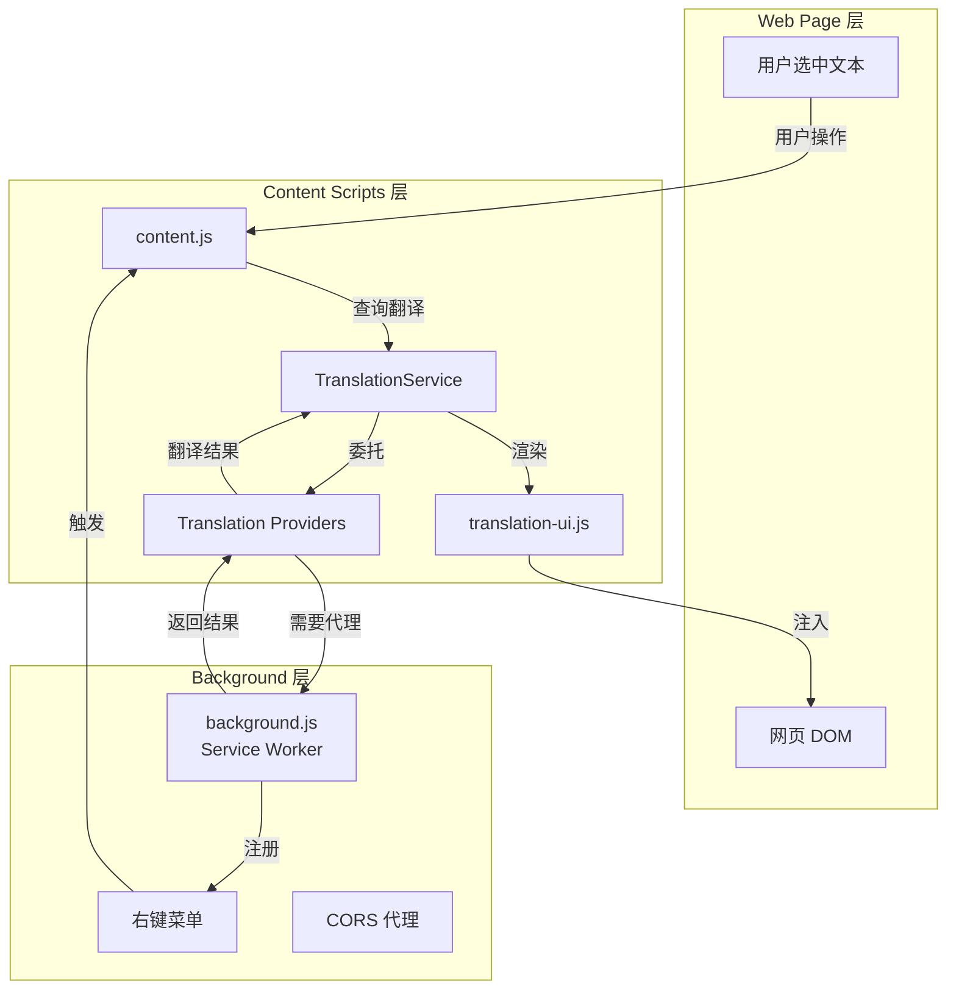
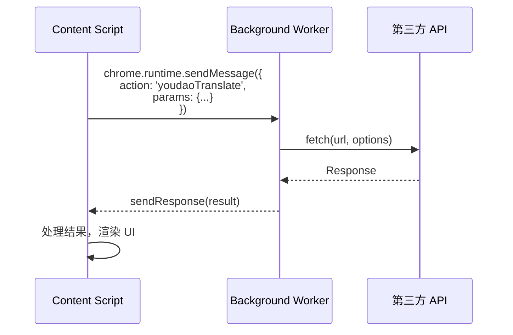
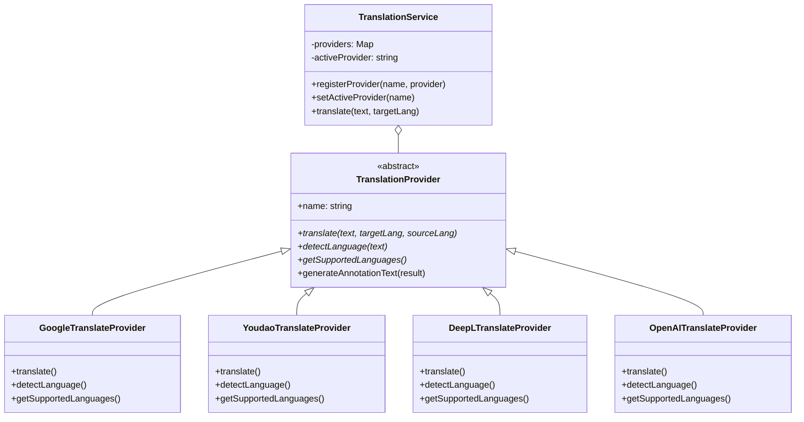
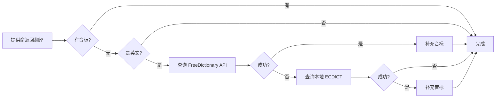
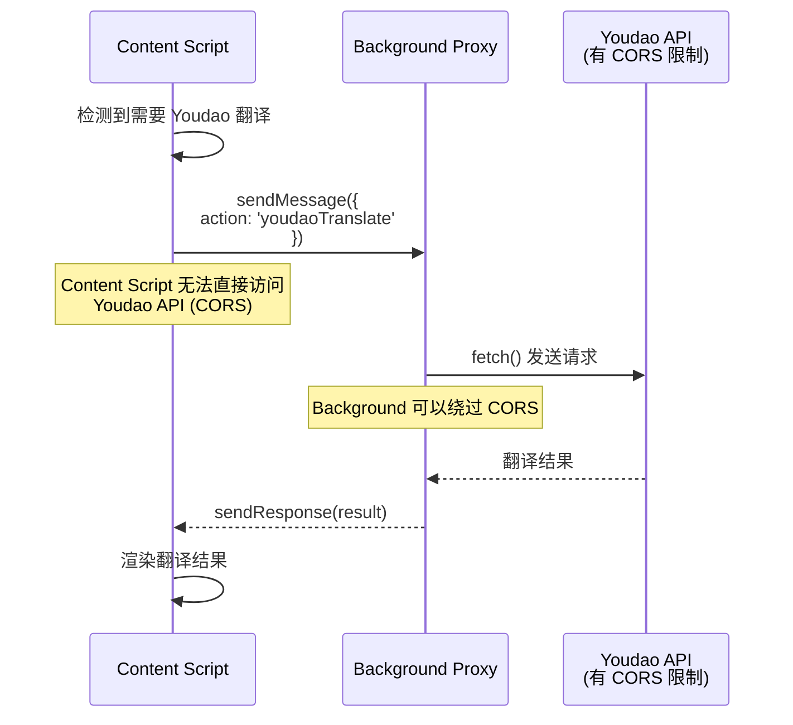
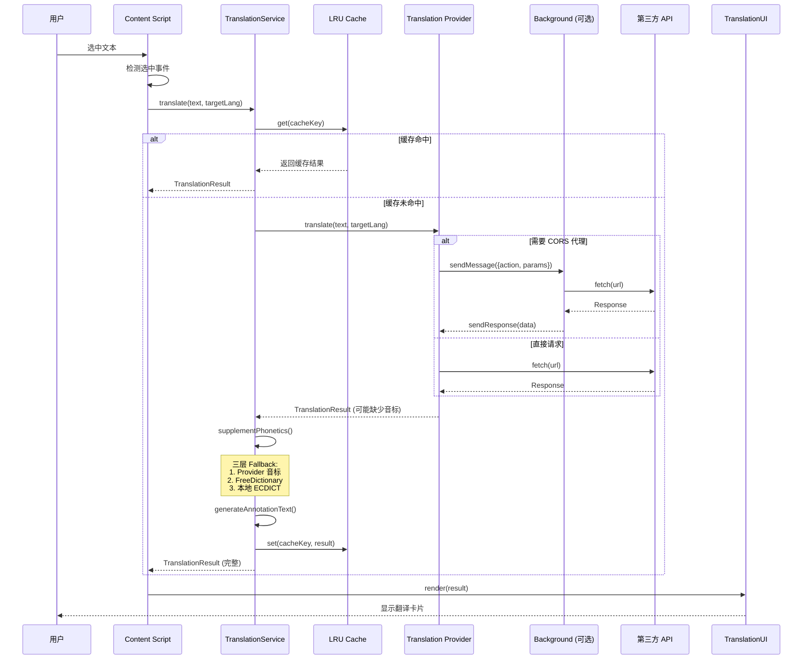
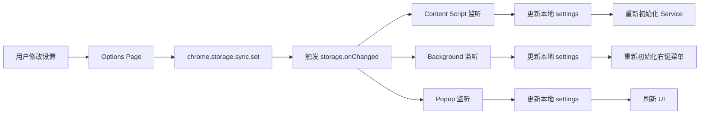

# 核心概念

本文档介绍 Annotate Translate 的核心概念和设计原则，帮助开发者理解系统的基础架构。

## 扩展架构概念

### 三层架构

Annotate Translate 遵循 Chrome Extension Manifest V3 的三层架构：



**各层职责**:

| 层级 | 运行环境 | 主要职责 | 生命周期 |
|-----|---------|---------|---------|
| **Background** | Service Worker 隔离环境 | - 右键菜单管理<br/>- CORS 代理<br/>- 设置初始化 | 事件驱动，非活动时休眠 |
| **Content Scripts** | 网页上下文 | - 文本选中检测<br/>- 翻译逻辑<br/>- UI 渲染<br/>- 标注注入 | 页面加载时注入，页面生命周期 |
| **Web Page** | 用户浏览的页面 | - 提供 DOM<br/>- 接收标注 | 浏览器控制 |

### 消息传递机制

由于 Chrome Extension 的安全限制，各层之间通过消息传递通信：



**消息传递协议**:

```javascript
// Content Script 发送消息
chrome.runtime.sendMessage({
  action: 'youdaoTranslate',  // 操作类型
  params: {                   // 参数对象
    url: 'https://...',
    method: 'POST',
    headers: {...},
    body: '...'
  }
}, (response) => {
  // 处理响应
});

// Background Script 接收消息
chrome.runtime.onMessage.addListener((request, sender, sendResponse) => {
  if (request.action === 'youdaoTranslate') {
    fetch(request.params.url, {...})
      .then(res => res.json())
      .then(data => sendResponse({ success: true, data }))
      .catch(err => sendResponse({ success: false, error: err.message }));
    return true; // 异步响应
  }
});
```

::: tip 为什么需要消息传递？
1. **安全隔离**: Content Scripts 在网页环境中运行，无法访问所有 Chrome API
2. **CORS 绕过**: Background 可以绕过 CORS 限制，代理请求到有域名限制的 API
3. **权限管理**: 某些 Chrome API (如 `chrome.storage`) 只能在特定上下文访问
:::

## 设计模式

### 1. Provider Pattern (提供商模式)

**目的**: 统一多个翻译提供商的接口，实现可插拔架构。



**优势**:
- ✅ **扩展性**: 添加新提供商只需实现 `TranslationProvider` 接口
- ✅ **切换灵活**: 运行时动态切换提供商
- ✅ **统一接口**: 调用方无需关心具体实现
- ✅ **测试友好**: 可以模拟提供商进行单元测试

**实现示例**:

```javascript
// 1. 定义抽象基类
class TranslationProvider {
  constructor(name) {
    if (new.target === TranslationProvider) {
      throw new Error('Cannot instantiate abstract class');
    }
    this.name = name;
  }

  async translate(text, targetLang, sourceLang = 'auto') {
    throw new Error('Must implement translate method');
  }

  async detectLanguage(text) {
    throw new Error('Must implement detectLanguage method');
  }

  getSupportedLanguages() {
    throw new Error('Must implement getSupportedLanguages method');
  }
}

// 2. 实现具体提供商
class GoogleTranslateProvider extends TranslationProvider {
  constructor() {
    super('google');
  }

  async translate(text, targetLang, sourceLang = 'auto') {
    // Google Translate API 调用
    const url = `https://translate.googleapis.com/...`;
    const response = await fetch(url);
    return this.parseResponse(response);
  }

  // ... 其他方法
}

// 3. 服务层管理提供商
class TranslationService {
  constructor() {
    this.providers = new Map();
    this.activeProvider = null;
  }

  registerProvider(name, provider) {
    this.providers.set(name, provider);
  }

  setActiveProvider(name) {
    if (!this.providers.has(name)) {
      throw new Error(`Provider ${name} not found`);
    }
    this.activeProvider = name;
  }

  async translate(text, targetLang, sourceLang = 'auto') {
    const provider = this.providers.get(this.activeProvider);
    return await provider.translate(text, targetLang, sourceLang);
  }
}
```

### 2. Singleton Pattern (单例模式)

**目的**: 确保全局只有一个 `TranslationService` 实例，统一管理缓存和提供商。

```javascript
// translation-service.js 全局单例
const translationService = new TranslationService();

// 注册所有提供商
translationService.registerProvider('google', new GoogleTranslateProvider());
translationService.registerProvider('youdao', new YoudaoTranslateProvider());
translationService.registerProvider('deepl', new DeepLTranslateProvider());
translationService.registerProvider('openai', new OpenAITranslateProvider());
translationService.registerProvider('freedictionary', new FreeDictionaryProvider());

// 所有模块共享同一个实例
```

**优势**:
- ✅ **统一缓存**: 所有翻译请求共享同一个缓存
- ✅ **状态一致**: 提供商切换全局生效
- ✅ **资源节省**: 避免重复实例化

::: warning 注意
在 Content Script 中，每个页面有独立的 `translationService` 实例。不同标签页之间的缓存**不共享**。
:::

### 3. Fallback Pattern (回退模式)

**目的**: 当首选方案失败时，自动尝试备选方案。

#### 示例 1: 音标补充三层回退



```javascript
async supplementPhonetics(result, text, sourceLang) {
  // 1. 提供商已返回音标，直接使用
  if (result.phonetics && result.phonetics.length > 0) {
    return result;
  }

  // 2. 仅对英文补充音标
  if (sourceLang !== 'en' && sourceLang !== 'auto') {
    return result;
  }

  // 3. Fallback 1: FreeDictionary API
  try {
    const fdResult = await this.freeDictionaryProvider.translate(text, 'en', 'en');
    if (fdResult.phonetics && fdResult.phonetics.length > 0) {
      result.phonetics = fdResult.phonetics;
      return result;
    }
  } catch (error) {
    console.warn('[TranslationService] FreeDictionary fallback failed:', error);
  }

  // 4. Fallback 2: 本地 ECDICT (未来实现)
  // const localPhonetic = await this.queryLocalDictionary(text);
  // if (localPhonetic) result.phonetics = [localPhonetic];

  return result;
}
```

#### 示例 2: 音频播放三层回退

```javascript
async playAudio(audioData, audioUrl, text, lang) {
  try {
    // 方案 1: 播放 ArrayBuffer 音频数据
    if (audioData) {
      await this.playArrayBufferAudio(audioData);
      return;
    }
  } catch (error) {
    console.warn('ArrayBuffer audio failed, fallback to URL');
  }

  try {
    // 方案 2: 播放 URL 音频
    if (audioUrl) {
      await this.playUrlAudio(audioUrl);
      return;
    }
  } catch (error) {
    console.warn('URL audio failed, fallback to TTS');
  }

  // 方案 3: 浏览器 TTS 朗读
  this.speakText(text, lang);
}
```

### 4. Proxy Pattern (代理模式)

**目的**: Background Service Worker 代理 Content Script 的跨域请求。



**实现**:

```javascript
// Content Script (youdao-translate-provider.js)
class YoudaoTranslateProvider extends TranslationProvider {
  async translate(text, targetLang, sourceLang = 'auto') {
    // 通过 Background 代理请求
    return new Promise((resolve, reject) => {
      chrome.runtime.sendMessage({
        action: 'youdaoTranslate',
        params: {
          url: this.apiEndpoint,
          method: 'POST',
          headers: { 'Content-Type': 'application/x-www-form-urlencoded' },
          body: this.buildRequestBody(text, targetLang, sourceLang)
        }
      }, (response) => {
        if (response.success) {
          resolve(this.parseResponse(response.data));
        } else {
          reject(new Error(response.error));
        }
      });
    });
  }
}

// Background Script (background.js)
chrome.runtime.onMessage.addListener((request, sender, sendResponse) => {
  if (request.action === 'youdaoTranslate') {
    fetch(request.params.url, {
      method: request.params.method,
      headers: request.params.headers,
      body: request.params.body
    })
      .then(res => res.json())
      .then(data => sendResponse({ success: true, data }))
      .catch(err => sendResponse({ success: false, error: err.message }));
    return true; // 保持消息通道开启
  }
});
```

### 5. Strategy Pattern (策略模式)

**目的**: 根据不同场景选择不同的翻译策略。

```javascript
class TranslationService {
  async translate(text, targetLang, sourceLang = 'auto', options = {}) {
    // 策略 1: 批量翻译模式
    if (options.batchMode) {
      return await this.batchTranslate(text.split(','), targetLang);
    }

    // 策略 2: 上下文感知翻译 (AI 提供商)
    if (this.activeProvider === 'openai' && options.context) {
      return await this.contextAwareTranslate(text, targetLang, options.context);
    }

    // 策略 3: 标准翻译
    return await this.standardTranslate(text, targetLang, sourceLang);
  }
}
```

## 核心抽象

### TranslationResult 数据结构

所有提供商的翻译结果统一为 `TranslationResult` 对象：

```typescript
interface TranslationResult {
  // 必需字段
  originalText: string;           // 原文
  translatedText: string;         // 译文
  detectedLanguage: string;       // 检测到的源语言 (ISO 639-1)

  // 可选字段
  phonetics?: PhoneticInfo[];     // 音标列表
  definitions?: Definition[];     // 释义列表
  examples?: Example[];           // 例句列表
  audio?: ArrayBuffer;            // 音频数据 (二进制)
  audioUrl?: string;              // 音频 URL

  // 元数据
  provider?: string;              // 提供商名称
  timestamp?: number;             // 翻译时间戳
  metadata?: {                    // 提供商特定数据
    tokensUsed?: number;          // AI 提供商: Token 消耗
    cost?: number;                // AI 提供商: 成本
    [key: string]: any;
  };
}

interface PhoneticInfo {
  text: string;                   // 音标文本 (如 "/həˈloʊ/")
  type?: string;                  // 音标类型 (如 "us", "uk")
  audio?: ArrayBuffer;            // 音频数据
  audioUrl?: string;              // 音频 URL
}

interface Definition {
  type: string;                   // 词性 (如 "n.", "v.")
  text: string;                   // 释义文本
}

interface Example {
  source: string;                 // 例句原文
  target: string;                 // 例句译文
}
```

**设计原则**:
- ✅ **必需字段最小化**: 只有 `originalText`, `translatedText`, `detectedLanguage` 是必需的
- ✅ **可选字段丰富**: 提供商可以按需添加音标、释义、例句等
- ✅ **类型一致**: 所有提供商返回相同结构，UI 层统一处理

### Settings 层级结构

设置采用树状结构，逻辑清晰，易于管理：

```javascript
const DEFAULT_SETTINGS = {
  general: {
    uiLanguage: 'zh_CN',           // UI 语言
    targetLanguage: 'zh-CN',       // 目标翻译语言
    enableFloatingMenu: true,      // 启用浮动菜单
    enableContextMenu: true,       // 启用右键菜单
    enableVocabularyMode: false    // 启用词汇模式
  },

  providers: {
    translationProvider: 'google', // 当前翻译提供商

    google: {
      // Google 无需配置
    },

    youdao: {
      appKey: '',                  // 有道 App Key
      appSecret: ''                // 有道 App Secret
    },

    deepl: {
      apiKey: '',                  // DeepL API Key
      endpoint: 'https://api-free.deepl.com/v2/translate'
    },

    openai: {
      apiKey: '',                  // OpenAI API Key
      model: 'gpt-3.5-turbo',
      baseURL: 'https://api.openai.com/v1',
      promptFormat: 'jsonFormat',  // 提示词格式
      useContext: true,            // 使用上下文
      temperature: 0.3,
      maxTokens: 500
    }
  },

  display: {
    translationCard: {
      position: 'auto',            // 卡片位置 (auto/top/bottom)
      maxWidth: 400,
      fontSize: 14
    },
    floatingMenu: {
      showDelay: 200,              // 显示延迟 (ms)
      hideDelay: 500
    },
    annotations: {
      color: '#3b82f6',            // 标注颜色
      underlineStyle: 'dotted'     // 下划线样式
    }
  },

  annotation: {
    showPhonetics: true,           // 显示音标
    showTranslation: true,         // 显示翻译
    showDefinitions: false         // 显示释义
  },

  performance: {
    cacheEnabled: true,
    cacheMaxSize: 100,             // 缓存条目数
    cacheTTL: 3600000              // 缓存 TTL (ms)
  },

  debug: {
    debugMode: false
  }
};
```

**访问设置**:

```javascript
// 方式 1: 直接访问 (完整路径)
const targetLang = settings.general.targetLanguage;
const apiKey = settings.providers.openai.apiKey;

// 方式 2: 使用 $ 助手 (简化访问，仅在 Content Script)
const targetLang = $.targetLanguage;  // 自动从 general 读取
const provider = $.translationProvider; // 自动从 providers 读取
```

## 数据流模式

### 翻译流程完整数据流



### 设置更新传播流程



**实现**:

```javascript
// 监听设置变化
chrome.storage.onChanged.addListener((changes, area) => {
  if (area === 'sync' && changes.settings) {
    const newSettings = changes.settings.newValue;

    // 更新本地 settings
    Object.assign(settings, newSettings);

    // 重新初始化 TranslationService
    if (changes.settings.newValue.providers.translationProvider !==
        changes.settings.oldValue.providers.translationProvider) {
      translationService.setActiveProvider(
        newSettings.providers.translationProvider
      );
      translationService.clearCache(); // 切换提供商时清除缓存
    }

    console.log('[Settings] Updated:', newSettings);
  }
});
```

## 关键机制

### 缓存机制 (LRU + TTL)

```javascript
class TranslationService {
  constructor() {
    this.cache = new Map(); // { key: { result, timestamp, accessCount } }
    this.cacheMaxSize = 100;
    this.cacheTTL = 3600000; // 1 小时
  }

  getCacheKey(text, sourceLang, targetLang, provider) {
    return `${text}:${sourceLang}:${targetLang}:${provider}`;
  }

  getFromCache(key) {
    const entry = this.cache.get(key);
    if (!entry) return null;

    // TTL 检查
    if (Date.now() - entry.timestamp > this.cacheTTL) {
      this.cache.delete(key);
      return null;
    }

    // LRU 更新
    entry.accessCount++;
    entry.timestamp = Date.now();

    return entry.result;
  }

  setToCache(key, result) {
    // LRU 淘汰
    if (this.cache.size >= this.cacheMaxSize) {
      // 找到访问次数最少的条目
      let minAccessKey = null;
      let minAccessCount = Infinity;

      for (const [k, v] of this.cache.entries()) {
        if (v.accessCount < minAccessCount) {
          minAccessCount = v.accessCount;
          minAccessKey = k;
        }
      }

      this.cache.delete(minAccessKey);
    }

    this.cache.set(key, {
      result,
      timestamp: Date.now(),
      accessCount: 1
    });
  }
}
```

**缓存策略**:
- ✅ **LRU 淘汰**: 缓存满时，淘汰访问次数最少的条目
- ✅ **TTL 过期**: 超过 1 小时的缓存自动失效
- ✅ **提供商隔离**: 不同提供商的翻译结果缓存独立
- ✅ **切换清除**: 切换提供商时清空缓存，避免混淆

### 错误处理与降级

```javascript
class TranslationService {
  async translate(text, targetLang, sourceLang = 'auto', options = {}) {
    try {
      // 1. 尝试主提供商
      const provider = this.providers.get(this.activeProvider);
      const result = await provider.translate(text, targetLang, sourceLang);

      // 2. 补充音标 (有 Fallback)
      await this.supplementPhonetics(result, text, sourceLang);

      return result;

    } catch (error) {
      console.error(`[TranslationService] Translation failed:`, error);

      // 3. 降级策略 1: 尝试 Google (如果当前不是 Google)
      if (this.activeProvider !== 'google' && this.providers.has('google')) {
        console.warn('[TranslationService] Fallback to Google Translate');
        try {
          const googleProvider = this.providers.get('google');
          return await googleProvider.translate(text, targetLang, sourceLang);
        } catch (googleError) {
          console.error('[TranslationService] Google fallback also failed:', googleError);
        }
      }

      // 4. 降级策略 2: 返回原文
      return {
        originalText: text,
        translatedText: text,
        detectedLanguage: sourceLang,
        error: error.message
      };
    }
  }
}
```

### 扩展上下文验证

Content Scripts 在扩展重载后可能失效，需要验证上下文：

```javascript
function isExtensionContextValid() {
  try {
    // 尝试访问 chrome.runtime API
    return !!chrome.runtime && !!chrome.runtime.id;
  } catch (e) {
    return false;
  }
}

// 使用示例
async function translateText(text) {
  if (!isExtensionContextValid()) {
    console.warn('[Content] Extension context invalid, please refresh page');
    return null;
  }

  // 继续翻译逻辑
  return await translationService.translate(text, 'zh-CN');
}
```

## 最佳实践

### 1. 添加新功能时的考虑

添加新功能时，问自己：

- ✅ 这个功能属于哪一层？(Background / Content Scripts / UI)
- ✅ 是否需要跨层通信？(消息传递)
- ✅ 是否需要持久化？(chrome.storage)
- ✅ 是否需要配置项？(settings 结构)
- ✅ 是否会影响性能？(缓存、批量处理)

### 2. 遵循现有模式

- ✅ 新的翻译提供商 → 继承 `TranslationProvider`
- ✅ 新的数据服务 → 参考 `TranslationService` 的单例模式
- ✅ 新的 UI 组件 → 参考 `TranslationUI` 的模块化设计
- ✅ 新的设置项 → 添加到 `settings-schema.js`

### 3. 测试策略

- ✅ **单元测试**: 提供商类的 `translate()` 方法
- ✅ **集成测试**: TranslationService 的完整翻译流程
- ✅ **E2E 测试**: 用户选中文本 → 翻译卡片显示
- ✅ **CORS 测试**: Background 代理功能

## 相关文档

- [架构概览](/development/architecture) - 系统整体架构
- [翻译服务](/development/translation-service) - TranslationService 详解
- [提供商系统](/development/providers) - Provider Pattern 实现
- [项目结构](/development/project-structure) - 文件组织结构
