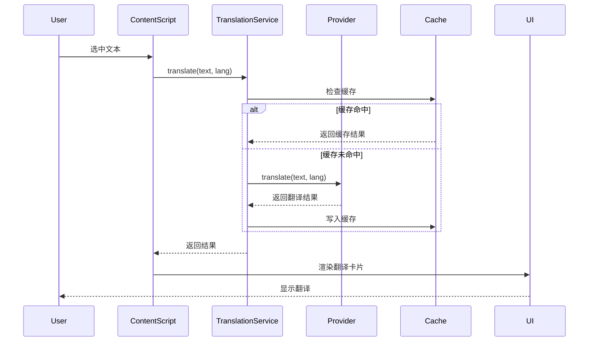

# 开发文档

欢迎来到 Annotate Translate 开发者文档！本文档面向想要理解项目架构、贡献代码或二次开发的开发者。

## 为什么选择 Annotate Translate？

### 优雅的架构设计

- **Provider Pattern** - 提供商模式实现多服务支持，易于扩展
- **Manifest V3** - 采用最新的 Chrome 扩展架构
- **无构建流程** - 纯 Vanilla JavaScript，直接加载运行
- **模块化设计** - 清晰的服务层抽象，31 个独立模块

### 强大的功能

- **多翻译提供商** - Google、Youdao、DeepL、OpenAI
- **AI 翻译** - 上下文感知，自定义提示词模板
- **词库系统** - 基于 ECDICT，支持多个标准词库
- **高性能缓存** - LRU + TTL 策略
- **国际化** - 支持 8 种语言

## 核心概念

在深入代码之前，建议先了解以下核心概念：

### Provider Pattern（提供商模式）

通过抽象的 `TranslationProvider` 接口，支持运行时切换不同的翻译服务：

```javascript
class TranslationProvider {
  async translate(text, targetLang, sourceLang) {
    // 子类实现
  }
}

// 注册和使用
translationService.registerProvider('google', new GoogleProvider());
translationService.setActiveProvider('google');
```

[详细了解提供商系统 →](/development/providers)

### Service Layer（服务层）

`TranslationService` 统一管理所有翻译操作：

```javascript
const result = await translationService.translate(
  'hello',
  'zh-CN',
  'auto'
);
```

[详细了解翻译服务 →](/development/translation-service)

### Chrome Extension MV3 架构

三层架构设计：

```
Background Service Worker
    ↓ (消息传递)
Content Scripts
    ↓ (DOM 操作)
Web Page
```

[详细了解扩展架构 →](/development/extension-architecture)

## 快速开始

### 1. 克隆仓库

```bash
git clone https://github.com/your-username/annotate-translate.git
cd annotate-translate
```

### 2. 加载扩展

1. 打开 Chrome 浏览器，访问 `chrome://extensions/`
2. 启用"开发者模式"（右上角开关）
3. 点击"加载已解压的扩展程序"
4. 选择项目根目录

### 3. 开始开发

- 修改代码后，点击扩展卡片上的刷新按钮
- 打开浏览器控制台查看日志
- 使用 Chrome DevTools 调试

[详细开发指南 →](/development/getting-started)

## 文档导航

### 📚 基础

<div class="vp-card-container">

- [架构概览](/development/architecture) - 系统整体架构
- [快速开始](/development/getting-started) - 开发环境搭建
- [项目结构](/development/project-structure) - 目录和文件组织
- [核心概念](/development/core-concepts) - 设计模式和关键思想

</div>

### 🔧 核心系统

<div class="vp-card-container">

- [扩展架构](/development/extension-architecture) - Manifest V3 详解
- [翻译服务](/development/translation-service) - TranslationService 深入
- [提供商系统](/development/providers) - 如何实现翻译提供商
- [AI 翻译](/development/ai-translation) - OpenAI 集成和提示词
- [词库系统](/development/vocabulary-system) - ECDICT 和词汇标注

</div>

### 🎨 专题

<div class="vp-card-container">

- [UI 组件](/development/ui-components) - 翻译卡片和标注 UI
- [设置管理](/development/settings-management) - 配置系统详解
- [缓存策略](/development/caching-strategy) - LRU 缓存实现
- [国际化](/development/i18n) - i18n 系统使用
- [调试指南](/development/debugging) - 调试技巧和工具

</div>

## 技术栈

- **运行环境**: Chrome Extension Manifest V3
- **编程语言**: Vanilla JavaScript (ES6+)
- **构建工具**: 无（直接加载）
- **存储**: Chrome Storage API (sync + local)
- **国际化**: Chrome i18n API
- **外部依赖**: Lucide Icons (CDN)

## 数据流示例



## 贡献代码

我们欢迎各种形式的贡献：

- 🐛 报告 Bug
- 💡 提出新功能
- 📝 改进文档
- 🔧 提交 Pull Request

请查看 [贡献指南](/contributing) 了解详情。

## 常见任务

### 添加新的翻译提供商

1. 创建提供商类继承 `TranslationProvider`
2. 实现 `translate()` 方法
3. 注册提供商
4. 添加配置界面

[详细教程 →](/recipes/add-new-provider)

### 自定义 AI 提示词

1. 编辑 `src/providers/prompt-templates.js`
2. 添加新的模板格式
3. 配置提供商使用新模板

[详细教程 →](/recipes/ai-prompt-template)

### 自定义词库

1. 准备词库数据（JSON 格式）
2. 创建词库提供商
3. 注册到 VocabularyService

[详细教程 →](/recipes/custom-vocabulary)

## 下一步

- 阅读 [架构概览](/development/architecture) 理解系统设计
- 查看 [API 参考](/api/) 了解接口详情
- 尝试 [实战示例](/recipes/) 动手实践
