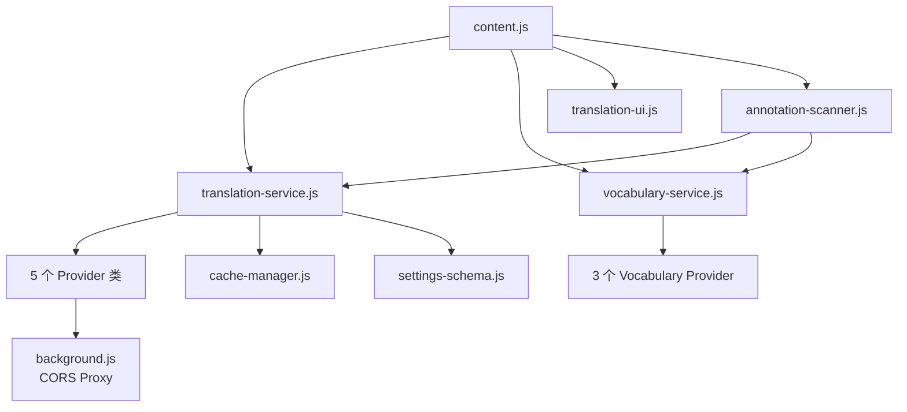

# 项目结构

本文档详细说明 Annotate Translate 的目录组织和文件职责。

## 项目概览

Annotate Translate 是一个**无构建流程**的 Chrome Manifest V3 扩展，所有代码都是纯 Vanilla JavaScript，通过 `manifest.json` 按顺序加载。

```
annotate-translate/
├── manifest.json           # 扩展清单（入口文件）
├── src/                    # 源代码目录
├── _locales/               # 国际化资源
├── assets/                 # 静态资源
├── test/                   # 测试文件
├── scripts/                # 工具脚本
├── docs/                   # VitePress 文档站点
└── README.md
```

## manifest.json

扩展的核心配置文件，定义了：

```json
{
  "manifest_version": 3,
  "name": "__MSG_extName__",
  "version": "1.0.0",

  "permissions": [
    "activeTab",
    "storage",
    "contextMenus",
    "scripting"
  ],

  "host_permissions": ["<all_urls>"],

  "background": {
    "service_worker": "src/background/background.js"
  },

  "content_scripts": [{
    "matches": ["<all_urls>"],
    "js": [
      "src/utils/constants.js",
      "src/utils/html-sanitizer.js",
      // ... 31 个文件按依赖顺序
      "src/content/content.js"  // 主入口最后加载
    ],
    "css": [
      "src/styles/translation-ui.css",
      "src/content/content.css"
    ]
  }]
}
```

**关键点**：
- 所有 JS 文件必须在 `content_scripts.js` 数组中按依赖顺序声明
- 依赖项必须在使用它们的文件之前加载
- 没有模块打包工具，依赖全局变量

## src/ 源代码目录

### 总览

```
src/
├── background/             # 后台服务工作者
├── content/                # 内容脚本
├── services/               # 核心服务层
├── providers/              # 提供商实现
├── utils/                  # 工具函数
├── options/                # 设置页面
├── popup/                  # 扩展弹出窗口
├── styles/                 # 全局样式
├── lib/                    # 第三方库
└── data/                   # 静态数据
```

### background/ - 后台服务工作者

**文件**: `background.js` (约 500 行)

**职责**:
- 扩展生命周期管理
- 上下文菜单创建
- CORS 代理（Youdao、DeepL、OpenAI）
- 消息路由
- 初始化默认设置

**核心功能**:

```javascript
// 1. 上下文菜单
chrome.runtime.onInstalled.addListener(() => {
  chrome.contextMenus.create({
    id: 'translate',
    title: chrome.i18n.getMessage('translate'),
    contexts: ['selection']
  });
});

// 2. CORS 代理
chrome.runtime.onMessage.addListener((request, sender, sendResponse) => {
  if (request.action === 'youdaoTranslate') {
    fetch(request.params.url, {...})
      .then(r => r.json())
      .then(data => sendResponse({ success: true, data }));
    return true; // 保持消息通道开放
  }
});

// 3. 初始化默认设置
chrome.runtime.onInstalled.addListener(() => {
  chrome.storage.sync.get(null, (items) => {
    if (Object.keys(items).length === 0) {
      chrome.storage.sync.set(DEFAULT_SETTINGS);
    }
  });
});
```

### content/ - 内容脚本

**核心文件**:

#### content.js (约 1200 行)
**职责**: 主入口，协调所有功能

```javascript
// 核心流程
document.addEventListener('mouseup', handleTextSelection);
document.addEventListener('dblclick', handleDoubleClick);

async function handleTextSelection() {
  const selectedText = window.getSelection().toString().trim();
  if (!selectedText || !$.enableTranslate) return;

  showFloatingMenu(selectedText, position);
}

async function translateText(text) {
  const result = await translationService.translate(
    text,
    $.targetLanguage,
    'auto'
  );
  TranslationUI.render(result, position);
}

async function annotateText(text, result) {
  const annotationText = translationService.generateAnnotationText(result);
  const ruby = createRubyElement(text, annotationText);
  replaceTextWithRuby(textNode, ruby);
  saveAnnotation(result);
}
```

**状态管理**:
- `settings` - 本地缓存的设置
- `currentTranslationCard` - 当前显示的翻译卡片
- `floatingMenu` - 浮动菜单 DOM 引用

#### translation-ui.js (约 800 行)
**职责**: 翻译结果 UI 渲染

```javascript
class TranslationUI {
  static render(result, position) {
    const card = this.createCard(result);
    this.positionCard(card, position);
    this.attachEventListeners(card, result);
    document.body.appendChild(card);
  }

  static createCard(result) {
    // 根据文本长度决定布局
    const isSimplified = result.originalText.length > 100;

    return `
      <div class="translation-card">
        <div class="header">...</div>
        ${isSimplified ? this.simplifiedLayout(result) : this.fullLayout(result)}
        <div class="actions">...</div>
      </div>
    `;
  }

  static attachAudioButtonListeners(card, phonetics) {
    // 三层 Fallback: ArrayBuffer → URL → TTS
  }
}
```

#### translation-integration.js (约 300 行)
**职责**: 翻译功能集成和辅助

**其他文件**:
- `content.css` - 内容脚本样式
- `vocabulary-ui.js` - 词汇模式 UI

### services/ - 核心服务层

#### translation-service.js (约 1500 行)
**最核心的文件**，实现翻译服务抽象层。

**核心类**:

```javascript
// TranslationProvider 抽象基类
class TranslationProvider {
  constructor(name, config) {}
  async translate(text, targetLang, sourceLang) {}
  async detectLanguage(text) {}
  getSupportedLanguages() {}
}

// 5 个提供商实现
class GoogleTranslateProvider extends TranslationProvider { }
class YoudaoTranslateProvider extends TranslationProvider { }
class DeepLTranslateProvider extends TranslationProvider { }
class OpenAITranslateProvider extends TranslationProvider { }
class FreeDictionaryProvider extends TranslationProvider { }

// TranslationService 单例
class TranslationService {
  constructor() {
    this.providers = new Map();
    this.activeProvider = null;
    this.cache = new Map();
    this.maxCacheSize = 100;
  }

  registerProvider(name, provider) { }
  setActiveProvider(name) { }

  async translate(text, targetLang, sourceLang, options) {
    // 1. 检查缓存
    // 2. 调用提供商
    // 3. 音标补充
    // 4. 生成标注文本
    // 5. 写入缓存
    // 6. 返回结果
  }

  async supplementPhoneticsFromFreeDictionary(result, text) { }
  generateAnnotationText(result) { }
}

// 全局单例
const translationService = new TranslationService();
```

[查看完整 TranslationService API →](/api/translation-service)

#### vocabulary-service.js (约 800 行)
**职责**: 词库管理

```javascript
class VocabularyService {
  constructor() {
    this.providers = new Map();
    this.activeProvider = null;
    this.cache = new Map();
  }

  async setActiveProvider(name, options) { }
  shouldAnnotate(word, context) { }
  batchCheck(words) { }
}
```

**词库提供商**:
- `CETVocabularyProvider` - CET-4/6 词库
- `FrequencyVocabularyProvider` - 词频词库
- `UnifiedVocabularyProvider` - 统一词库（推荐）

#### annotation-scanner.js (约 600 行)
**职责**: 页面扫描和批量标注

```javascript
class AnnotationScanner {
  constructor(vocabularyService, translationService) {}

  async scanAndAnnotate(rootElement, options) {
    this.abortController = new AbortController();

    // 1. 提取文本节点
    const textNodes = this.extractTextNodes(rootElement);

    // 2. 分词并过滤
    const words = this.extractWords(textNodes);

    // 3. 批量检查
    const toAnnotate = this.vocabularyService.batchCheck(words);

    // 4. 批量翻译
    for (const word of toAnnotate) {
      if (this.abortController.signal.aborted) break;
      const result = await this.translationService.translate(word);
      this.injectAnnotation(word, result);
    }
  }

  abort() { }
}
```

#### ai-translation-service.js (约 400 行)
**职责**: AI 翻译统一管理

#### token-stats-service.js (约 200 行)
**职责**: AI Token 统计和成本计算

### providers/ - 提供商实现

#### openai-provider.js (约 500 行)
OpenAI 兼容 API 适配器

```javascript
class OpenAIProvider extends BaseAIProvider {
  constructor(config) {
    this.apiEndpoint = `${config.baseURL}/chat/completions`;
    this.model = config.model || 'gpt-3.5-turbo';
    this.temperature = config.temperature ?? 0.3;
  }

  async translate(text, sourceLang, targetLang, options) {
    const prompts = PromptTemplates.buildPrompt({
      text, sourceLang, targetLang,
      format: this.promptFormat,
      context: options.context
    });

    const response = await this.sendRequestViaBackground(...);
    return this.parseResponse(response);
  }
}
```

#### base-ai-provider.js (约 300 行)
AI 提供商抽象基类

#### prompt-templates.js (约 600 行)
AI 提示词模板系统

```javascript
class PromptTemplates {
  static buildPrompt(options) {
    const { format } = options;
    return format === 'jsonFormat'
      ? this.buildJsonPrompt(options)
      : this.buildSimplePrompt(options);
  }

  static buildJsonPrompt({ text, sourceLang, targetLang, context }) {
    return {
      system: '你是一个专业的翻译助手...',
      user: `翻译以下${sourceLang}文本到${targetLang}:\n${text}\n上下文: ${context}`
    };
  }
}
```

#### vocabulary/ - 词库提供商
```
vocabulary/
├── base-provider.js         # 词库提供商基类
├── cet-provider.js          # CET-4/6 提供商
├── frequency-provider.js    # 词频提供商
└── unified-provider.js      # 统一提供商（推荐）
```

### utils/ - 工具函数

#### settings-schema.js (约 500 行)
**最重要的配置文件**，定义默认设置结构

```javascript
const DEFAULT_SETTINGS = {
  general: {
    enableTranslate: true,
    targetLanguage: 'zh-CN',
    enablePhoneticFallback: true
  },
  providers: {
    current: 'google',
    google: { enabled: true },
    youdao: { appKey: '', appSecret: '' },
    deepl: { apiKey: '', useFreeApi: true },
    openai: { apiKey: '', model: 'gpt-3.5-turbo', baseURL: '...' },
    aiProviders: [...]
  },
  annotation: {
    showPhonetics: true,
    showTranslation: true,
    showDefinitions: false
  },
  translationCard: {
    showPhonetics: true,
    enableAudio: true,
    showDefinitions: true,
    showExamples: true
  },
  vocabulary: { ... },
  performance: {
    enableCache: true,
    cacheSize: 100
  },
  debug: { enableDebugMode: false }
};
```

#### cache-manager.js (约 300 行)
LRU 缓存管理器

```javascript
class CacheManager {
  constructor(options = {}) {
    this.maxSize = options.maxSize || 100;
    this.ttl = options.ttl || (30 * 60 * 1000); // 30分钟
    this.cache = new Map();
  }

  get(key) { }
  set(key, value, customTTL) { }
  cleanup() { }
}
```

#### html-sanitizer.js (约 200 行)
HTML 安全清理器

#### i18n-helper.js (约 100 行)
国际化辅助函数

```javascript
function safeGetMessage(key, substitutions = null, fallback = '') {
  if (!isExtensionContextValid()) return fallback;
  return chrome.i18n.getMessage(key, substitutions) || fallback;
}
```

**其他工具**:
- `message-helper.js` - 扩展消息辅助
- `event-manager.js` - 事件管理
- `input-validator.js` - 输入验证
- `constants.js` - 常量定义
- `secure-storage.js` - 安全存储

### options/ - 设置页面

```
options/
├── options.html            # 设置页面 UI
├── options.js              # 设置页面逻辑（约 1000 行）
├── options.css             # 样式
└── ai-providers-manager.js # AI 提供商管理器
```

**options.js 核心功能**:
- 加载和保存设置
- 表单绑定和验证
- 提供商连接测试
- 数据导入导出

### popup/ - 扩展弹出窗口

```
popup/
├── popup.html              # 弹出窗口 UI
├── popup.js                # 逻辑（约 400 行）
└── popup.css               # 样式
```

**功能**:
- 快速开关功能
- 切换翻译提供商
- 查看词库统计
- 快捷设置访问

### styles/ - 全局样式

```
styles/
├── translation-ui.css      # 翻译卡片样式
└── common.css              # 通用样式
```

### lib/ - 第三方库

```
lib/
└── lucide-icons.js         # Lucide Icons (CDN 加载)
```

### data/ - 静态数据

```
data/
└── vocabularies/
    ├── vocabulary-core.json      # 核心词库数据
    ├── cet4.json
    ├── cet6.json
    ├── toefl.json
    ├── ielts.json
    └── gre.json
```

**数据格式**:
```json
{
  "meta": {
    "version": "1.0.0",
    "totalWords": 10000
  },
  "words": {
    "abandon": {
      "tags": ["cet4", "cet6"],
      "collins": 4,
      "frequency": 5234
    }
  }
}
```

## _locales/ - 国际化资源

```
_locales/
├── en/
│   └── messages.json       # 英文
├── zh_CN/
│   └── messages.json       # 简体中文
├── zh_TW/
│   └── messages.json       # 繁体中文
├── de/
├── es/
├── fr/
├── ja/
└── ko/
```

**消息格式**:
```json
{
  "extName": {
    "message": "Annotate Translate",
    "description": "Extension name"
  },
  "translate": {
    "message": "翻译",
    "description": "Translate button text"
  }
}
```

**使用方式**:
```javascript
// manifest.json 中
"name": "__MSG_extName__"

// JS 中
const text = chrome.i18n.getMessage('translate');

// 带占位符
chrome.i18n.getMessage('wordCount', [10]);
```

## assets/ - 静态资源

```
assets/
└── icons/
    ├── icon16.png
    ├── icon32.png
    ├── icon48.png
    ├── icon128.png
    └── providers/          # 提供商 Logo
        ├── google.svg
        ├── youdao.svg
        ├── deepl.svg
        └── openai.svg
```

## scripts/ - 工具脚本

```
scripts/
├── README.md               # ECDICT 处理说明
└── convert-ecdict.js       # ECDICT 数据转换脚本（Node.js）
```

**用途**: 将 ECDICT CSV 数据转换为 JSON 格式

## test/ - 测试文件

```
test/
├── test-ai-translation.html    # AI 翻译功能测试
└── translation-test.html       # 翻译功能测试
```

在浏览器中打开进行手动测试。

## docs/ - VitePress 文档站点

```
docs/
├── .vitepress/
│   └── config.mts
├── guide/
├── development/
├── api/
├── recipes/
├── design/
├── resources/
└── index.md
```

[查看文档站点说明 →](../README.md)

## 文件加载顺序

**Content Scripts 加载顺序**（来自 `manifest.json`）:

```
1. 常量和工具
   ├── constants.js
   ├── html-sanitizer.js
   ├── input-validator.js
   ├── secure-storage.js
   └── event-manager.js

2. 辅助函数
   ├── i18n-helper.js
   ├── message-helper.js
   └── settings-schema.js

3. 缓存管理
   └── cache-manager.js

4. 提供商系统
   ├── prompt-templates.js
   ├── base-ai-provider.js
   ├── openai-provider.js
   ├── vocabulary/base-provider.js
   ├── vocabulary/cet-provider.js
   ├── vocabulary/frequency-provider.js
   └── vocabulary/unified-provider.js

5. 核心服务
   ├── translation-service.js      # 最核心
   ├── ai-translation-service.js
   ├── token-stats-service.js
   ├── vocabulary-service.js
   └── annotation-scanner.js

6. UI 组件
   ├── translation-ui.js
   └── vocabulary-ui.js

7. 集成层
   ├── translation-integration.js
   └── content.js                  # 主入口（最后）
```

**为什么这个顺序很重要？**
- 依赖项必须在使用它们的文件之前加载
- 无模块系统，依赖全局变量
- 错误的顺序会导致 `ReferenceError`

## 代码统计

```
总计 JavaScript 文件: 31
总计代码行数: ~15,000 行

核心文件:
- translation-service.js: ~1,500 行
- content.js: ~1,200 行
- options.js: ~1,000 行
- translation-ui.js: ~800 行
- vocabulary-service.js: ~800 行
```

## 关键依赖关系



## 模块化策略

虽然没有构建工具，但代码通过以下方式保持模块化：

1. **类封装** - 每个功能封装在类中
2. **单一职责** - 每个文件负责一个明确的功能
3. **全局单例** - 核心服务作为全局单例
4. **依赖注入** - 通过构造函数传递依赖

```javascript
// 示例：依赖注入
class AnnotationScanner {
  constructor(vocabularyService, translationService) {
    this.vocabularyService = vocabularyService;
    this.translationService = translationService;
  }
}

// 在 content.js 中初始化
const annotationScanner = new AnnotationScanner(
  vocabularyService,
  translationService
);
```

## 下一步

- 了解 [核心概念](/development/core-concepts)
- 深入 [翻译服务](/development/translation-service)
- 查看 [提供商系统](/development/providers)
- 学习 [如何添加新文件](/recipes/add-new-provider)
