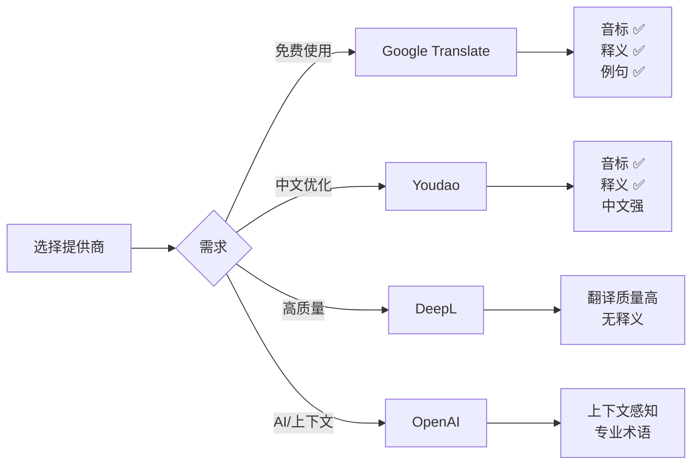
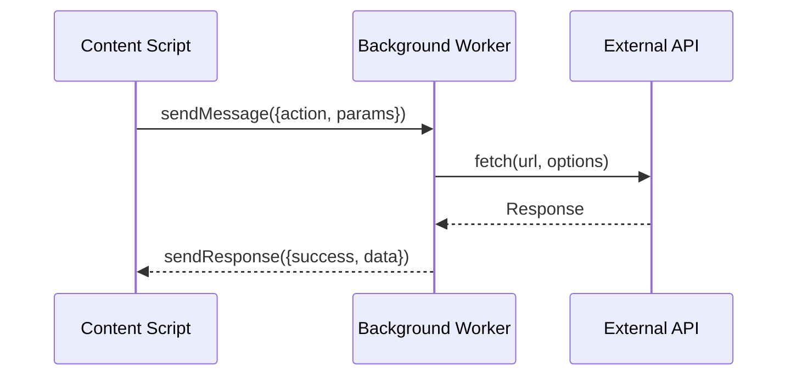

# 提供商系统

提供商系统是 Annotate Translate 的核心特性之一，通过 Provider Pattern 实现多个翻译服务的统一管理和无缝切换。

## 提供商概览

### 已实现的提供商

| 提供商 | 类名 | 免费 | 需要配置 | 特性 | 推荐场景 |
|--------|------|------|---------|------|---------|
| **Google Translate** | `GoogleTranslateProvider` | ✅ | ❌ | 音标、释义、例句 | 日常使用、快速翻译 |
| **Youdao** | `YoudaoTranslateProvider` | ❌ | ✅ API Key | 中文优化、音标 | 中文学习、专业翻译 |
| **DeepL** | `DeepLTranslateProvider` | ❌ | ✅ API Key | 高质量翻译 | 文档翻译、文学作品 |
| **OpenAI** | `OpenAITranslateProvider` | ❌ | ✅ API Key | AI 驱动、上下文感知 | 专业术语、技术文档 |
| **FreeDictionary** | `FreeDictionaryProvider` | ✅ | ❌ | 音标补充（仅英文） | 音标补充（自动） |

### 提供商对比



## Provider Pattern 实现

### 抽象基类

```javascript
/**
 * TranslationProvider 抽象基类
 * 所有翻译提供商必须实现这个接口
 */
class TranslationProvider {
  constructor(name, config = {}) {
    this.name = name;
    this.config = config;
  }

  /**
   * 翻译文本（必须实现）
   * @param {string} text - 要翻译的文本
   * @param {string} targetLang - 目标语言
   * @param {string} sourceLang - 源语言
   * @param {Object} options - 额外选项
   * @returns {Promise<TranslationResult>}
   */
  async translate(text, targetLang, sourceLang = 'auto', options = {}) {
    throw new Error(`${this.name}: Must implement translate()`);
  }

  /**
   * 检测语言（可选实现）
   */
  async detectLanguage(text) {
    return 'auto';
  }

  /**
   * 获取支持的语言列表（可选实现）
   */
  getSupportedLanguages() {
    return [];
  }

  /**
   * 生成标注文本（可选实现）
   * 默认使用 TranslationService 的实现
   */
  generateAnnotationText(result) {
    return null; // 使用服务层的实现
  }
}
```

### 注册和使用

```javascript
// 1. 创建提供商实例
const googleProvider = new GoogleTranslateProvider();
const youdaoProvider = new YoudaoTranslateProvider({
  appKey: 'your-app-key',
  appSecret: 'your-app-secret'
});

// 2. 注册到 TranslationService
translationService.registerProvider('google', googleProvider);
translationService.registerProvider('youdao', youdaoProvider);

// 3. 设置当前提供商
translationService.setActiveProvider('google');

// 4. 使用
const result = await translationService.translate('hello', 'zh-CN');
```

## 各提供商详解

### 1. GoogleTranslateProvider

**特点**:
- ✅ 完全免费
- ✅ 无需配置
- ✅ 支持音标、释义、例句
- ⚠️ 有使用频率限制
- ⚠️ 可能不稳定

**API 端点**:
```
https://translate.googleapis.com/translate_a/single
```

**实现核心**:

```javascript
class GoogleTranslateProvider extends TranslationProvider {
  async translate(text, targetLang, sourceLang = 'auto') {
    const url = this.buildUrl(text, targetLang, sourceLang);

    try {
      const response = await fetch(url);
      const data = await response.json();

      return this.parseResponse(data, text, targetLang, sourceLang);
    } catch (error) {
      throw new TranslationError(error.message, 'NETWORK_ERROR', 'google');
    }
  }

  buildUrl(text, targetLang, sourceLang) {
    const params = new URLSearchParams({
      client: 'gtx',
      sl: sourceLang,
      tl: targetLang,
      dt: ['t', 'bd', 'ex', 'md', 'rw', 'ss'],
      q: text
    });

    return `https://translate.googleapis.com/translate_a/single?${params}`;
  }

  parseResponse(data, text, targetLang, sourceLang) {
    return {
      originalText: text,
      translatedText: data[0][0][0],
      sourceLang: data[2] || sourceLang,
      targetLang: targetLang,
      phonetics: this.extractPhonetics(data),
      definitions: this.extractDefinitions(data),
      examples: this.extractExamples(data),
      provider: 'google',
      providerDisplayName: 'Google Translate',
      timestamp: Date.now()
    };
  }

  extractPhonetics(data) {
    // data[0][1] 包含音标
    if (data[0] && data[0][1]) {
      return [{
        text: data[0][1],
        type: 'default'
      }];
    }
    return [];
  }

  extractDefinitions(data) {
    // data[12] 包含释义
    const definitions = [];
    if (data[12]) {
      for (const group of data[12]) {
        const partOfSpeech = group[0];
        for (const def of group[1]) {
          definitions.push({
            partOfSpeech,
            text: def[0]
          });
        }
      }
    }
    return definitions;
  }

  extractExamples(data) {
    // data[13] 包含例句
    const examples = [];
    if (data[13]) {
      for (const ex of data[13][0]) {
        examples.push({
          source: ex[0],
          translation: ''
        });
      }
    }
    return examples;
  }
}
```

[查看完整 API 文档 →](/api/providers/google)

### 2. YoudaoTranslateProvider

**特点**:
- ✅ 中文翻译优化
- ✅ 支持音标（US/UK）
- ✅ 网络释义和例句
- ❌ 需要 API Key（appKey + appSecret）
- ⚠️ CORS 限制（需要 Background 代理）

**配置**:

```javascript
const config = {
  appKey: 'your-app-key',         // 有道智云应用 ID
  appSecret: 'your-app-secret'     // 应用密钥
};

const provider = new YoudaoTranslateProvider(config);
```

**签名算法**:

```javascript
class YoudaoTranslateProvider extends TranslationProvider {
  generateSign(appKey, appSecret, salt, curtime, query) {
    // 计算 input（用于签名）
    const input = query.length <= 20
      ? query
      : query.substring(0, 10) + query.length + query.substring(query.length - 10);

    // SHA256 签名
    const str = appKey + input + salt + curtime + appSecret;
    const sign = CryptoJS.SHA256(str).toString();

    return sign;
  }

  async translate(text, targetLang, sourceLang) {
    const salt = Date.now().toString();
    const curtime = Math.floor(Date.now() / 1000).toString();
    const sign = this.generateSign(
      this.config.appKey,
      this.config.appSecret,
      salt,
      curtime,
      text
    );

    // 通过 Background 发送请求（绕过 CORS）
    const data = await this.sendRequestViaBackground({
      url: 'https://openapi.youdao.com/api',
      method: 'POST',
      headers: { 'Content-Type': 'application/x-www-form-urlencoded' },
      body: new URLSearchParams({
        q: text,
        from: this.mapLanguageCode(sourceLang),
        to: this.mapLanguageCode(targetLang),
        appKey: this.config.appKey,
        salt,
        sign,
        signType: 'v3',
        curtime
      }).toString()
    });

    return this.parseResponse(data, text, targetLang, sourceLang);
  }

  async sendRequestViaBackground(params) {
    return new Promise((resolve, reject) => {
      chrome.runtime.sendMessage({
        action: 'youdaoTranslate',
        params
      }, (response) => {
        if (response.success) {
          resolve(response.data);
        } else {
          reject(new Error(response.error));
        }
      });
    });
  }
}
```

**语言代码映射**:

```javascript
mapLanguageCode(code) {
  const map = {
    'auto': 'auto',
    'zh-CN': 'zh-CHS',
    'zh-TW': 'zh-CHT',
    'en': 'en',
    'ja': 'ja',
    'ko': 'ko',
    'fr': 'fr',
    'es': 'es',
    'ru': 'ru'
  };
  return map[code] || code;
}
```

[查看完整 API 文档 →](/api/providers/youdao)

### 3. DeepLTranslateProvider

**特点**:
- ✅ 翻译质量非常高
- ✅ 支持多种语言
- ❌ 无音标和释义
- ❌ 需要 API Key
- ⚠️ CORS 限制（需要 Background 代理）

**配置**:

```javascript
const config = {
  apiKey: 'your-api-key',    // DeepL API Key
  useFreeApi: true           // true = Free API, false = Pro API
};

const provider = new DeepLTranslateProvider(config);
```

**API 端点自动检测**:

```javascript
class DeepLTranslateProvider extends TranslationProvider {
  constructor(config) {
    super('deepl', config);

    // 自动检测 API Key 类型
    const isFreeKey = config.apiKey && config.apiKey.endsWith(':fx');
    const useFreeApi = config.useFreeApi ?? isFreeKey;

    this.apiEndpoint = useFreeApi
      ? 'https://api-free.deepl.com/v2/translate'
      : 'https://api.deepl.com/v2/translate';
  }

  async translate(text, targetLang, sourceLang) {
    const data = await this.sendRequestViaBackground({
      url: this.apiEndpoint,
      method: 'POST',
      headers: {
        'Authorization': `DeepL-Auth-Key ${this.config.apiKey}`,
        'Content-Type': 'application/json'
      },
      body: JSON.stringify({
        text: [text],
        source_lang: this.mapLanguageCode(sourceLang),
        target_lang: this.mapLanguageCode(targetLang)
      })
    });

    return {
      originalText: text,
      translatedText: data.translations[0].text,
      sourceLang: data.translations[0].detected_source_language || sourceLang,
      targetLang: targetLang,
      phonetics: [],          // DeepL 不提供音标
      definitions: [],        // DeepL 不提供释义
      examples: [],           // DeepL 不提供例句
      provider: 'deepl',
      providerDisplayName: 'DeepL',
      timestamp: Date.now()
    };
  }
}
```

**音标补充**:

DeepL 不提供音标，但 `TranslationService` 会自动通过 FreeDictionary 补充（如果启用）。

[查看完整 API 文档 →](/api/providers/deepl)

### 4. OpenAITranslateProvider

**特点**:
- ✅ AI 驱动，理解上下文
- ✅ 支持专业术语翻译
- ✅ 可自定义提示词
- ✅ 返回音标和释义（通过 AI 生成）
- ❌ 需要 API Key
- ❌ 有成本（按 Token 计费）

**配置**:

```javascript
const config = {
  apiKey: 'your-api-key',
  model: 'gpt-3.5-turbo',              // 或 'gpt-4'
  baseURL: 'https://api.openai.com/v1', // OpenAI 兼容端点
  temperature: 0.3,
  maxTokens: 500,
  promptFormat: 'jsonFormat',           // 或 'simpleFormat'
  useContext: true                      // 是否使用上下文
};

const provider = new OpenAITranslateProvider(config);
```

**核心实现**:

```javascript
class OpenAITranslateProvider extends BaseAIProvider {
  async translate(text, sourceLang, targetLang, options = {}) {
    // 1. 构建提示词
    const prompts = PromptTemplates.buildPrompt({
      text,
      sourceLang,
      targetLang,
      format: this.promptFormat,
      context: this.useContext ? (options.context || '') : ''
    });

    // 2. 调用 OpenAI API
    const response = await this.sendRequestViaBackground({
      url: `${this.baseURL}/chat/completions`,
      method: 'POST',
      headers: {
        'Authorization': `Bearer ${this.apiKey}`,
        'Content-Type': 'application/json'
      },
      body: JSON.stringify({
        model: this.model,
        messages: [
          { role: 'system', content: prompts.system },
          { role: 'user', content: prompts.user }
        ],
        temperature: this.temperature,
        max_tokens: this.maxTokens
      })
    });

    // 3. 解析响应
    const result = this.promptFormat === 'jsonFormat'
      ? this.parseJsonResponse(response)
      : this.parseSimpleResponse(response);

    // 4. 添加元数据
    result.metadata = {
      tokensUsed: response.usage.total_tokens,
      cost: this.calculateCost(response.usage.total_tokens),
      promptTokens: response.usage.prompt_tokens,
      completionTokens: response.usage.completion_tokens
    };

    return result;
  }

  parseJsonResponse(response) {
    const content = response.choices[0].message.content;
    const data = JSON.parse(content);

    return {
      originalText: this.lastText,
      translatedText: data.translation,
      sourceLang: this.lastSourceLang,
      targetLang: this.lastTargetLang,
      phonetics: data.phonetic ? [{
        text: data.phonetic,
        type: 'default'
      }] : [],
      definitions: data.definitions ? data.definitions.map(d => ({
        partOfSpeech: '',
        text: d
      })) : [],
      examples: [],
      provider: 'openai',
      providerDisplayName: 'OpenAI',
      timestamp: Date.now()
    };
  }

  calculateCost(tokens) {
    const rates = {
      'gpt-3.5-turbo': 0.002 / 1000,  // $0.002 / 1K tokens
      'gpt-4': 0.03 / 1000             // $0.03 / 1K tokens
    };
    return (rates[this.model] || 0) * tokens;
  }
}
```

[查看完整 AI 翻译文档 →](/development/ai-translation)

[查看 OpenAI API 文档 →](/api/providers/openai)

### 5. FreeDictionaryProvider

**特点**:
- ✅ 完全免费
- ✅ 提供英文单词音标
- ✅ 提供音频 URL
- ❌ 仅支持英文
- ❌ 不提供翻译（专用于音标补充）

**用途**:

FreeDictionary 不是翻译提供商，而是**音标补充提供商**，用于：
- 当其他提供商没有返回音标时自动补充
- 仅对英文单词有效

**实现**:

```javascript
class FreeDictionaryProvider extends TranslationProvider {
  async fetchPhonetics(word) {
    const url = `https://api.dictionaryapi.dev/api/v2/entries/en/${word}`;

    try {
      const response = await fetch(url);
      const data = await response.json();

      if (Array.isArray(data) && data.length > 0) {
        return this.parsePhonetics(data[0]);
      }
    } catch (error) {
      console.warn('[FreeDictionary] Failed to fetch:', error);
    }

    return null;
  }

  parsePhonetics(entry) {
    const phonetics = [];

    if (entry.phonetics) {
      for (const p of entry.phonetics) {
        if (p.text) {
          phonetics.push({
            text: p.text,
            type: this.guessPhoneticType(p),
            audioUrl: p.audio || null
          });
        }
      }
    }

    return { phonetics };
  }

  guessPhoneticType(phonetic) {
    if (phonetic.audio && phonetic.audio.includes('us')) {
      return 'us';
    } else if (phonetic.audio && phonetic.audio.includes('uk')) {
      return 'uk';
    }
    return 'ipa';
  }
}
```

[查看完整 API 文档 →](/api/providers/freedictionary)

## CORS 代理机制

### 为什么需要 CORS 代理？

某些翻译 API（Youdao、DeepL、OpenAI）不支持跨域请求（CORS），Content Script 无法直接调用。

**解决方案**: Background Service Worker 代理



### Background 代理实现

**background.js**:

```javascript
chrome.runtime.onMessage.addListener((request, sender, sendResponse) => {
  // Youdao 代理
  if (request.action === 'youdaoTranslate') {
    fetch(request.params.url, {
      method: request.params.method,
      headers: request.params.headers,
      body: request.params.body
    })
    .then(r => r.json())
    .then(data => sendResponse({ success: true, data }))
    .catch(err => sendResponse({ success: false, error: err.message }));

    return true; // 保持消息通道开放
  }

  // DeepL 代理
  if (request.action === 'deeplTranslate') {
    fetch(request.params.url, {
      method: request.params.method,
      headers: request.params.headers,
      body: request.params.body
    })
    .then(r => r.json())
    .then(data => sendResponse({ success: true, data }))
    .catch(err => sendResponse({ success: false, error: err.message }));

    return true;
  }

  // OpenAI 代理
  if (request.action === 'openaiTranslate') {
    // 同上...
    return true;
  }
});
```

### Provider 端发送请求

```javascript
async sendRequestViaBackground(params) {
  return new Promise((resolve, reject) => {
    chrome.runtime.sendMessage({
      action: 'youdaoTranslate',  // 或 deeplTranslate、openaiTranslate
      params: {
        url: 'https://...',
        method: 'POST',
        headers: {...},
        body: '...'
      }
    }, (response) => {
      if (response && response.success) {
        resolve(response.data);
      } else {
        reject(new Error(response?.error || 'Request failed'));
      }
    });
  });
}
```

[完整 CORS 代理教程 →](/recipes/cors-proxy)

## 添加新提供商

### 步骤

1. **创建提供商类**

```javascript
class MyCustomProvider extends TranslationProvider {
  constructor(config) {
    super('mycustom', config);
  }

  async translate(text, targetLang, sourceLang) {
    // 实现翻译逻辑
    const response = await fetch('https://api.example.com/translate', {
      method: 'POST',
      headers: { 'Authorization': `Bearer ${this.config.apiKey}` },
      body: JSON.stringify({ text, target: targetLang })
    });

    const data = await response.json();

    return {
      originalText: text,
      translatedText: data.translation,
      sourceLang: sourceLang,
      targetLang: targetLang,
      phonetics: [],
      definitions: [],
      examples: [],
      provider: 'mycustom',
      providerDisplayName: 'My Custom Translator',
      timestamp: Date.now()
    };
  }
}
```

2. **注册提供商**

在 `translation-service.js` 初始化部分：

```javascript
translationService.registerProvider('mycustom', new MyCustomProvider({
  apiKey: settings.providers.mycustom?.apiKey
}));
```

3. **添加到设置**

在 `settings-schema.js` 中添加：

```javascript
DEFAULT_SETTINGS.providers.mycustom = {
  enabled: false,
  apiKey: '',
  connectionStatus: null
};
```

4. **添加 UI**

在 `options.html` 和 `options.js` 中添加配置界面。

[完整教程 →](/recipes/add-new-provider)

## 最佳实践

### 1. 错误处理

```javascript
async translate(text, targetLang, sourceLang) {
  try {
    const response = await fetch(url);

    if (!response.ok) {
      throw new Error(`HTTP ${response.status}: ${response.statusText}`);
    }

    const data = await response.json();
    return this.parseResponse(data);

  } catch (error) {
    if (error.name === 'TypeError') {
      throw new TranslationError('Network error', 'NETWORK_ERROR', this.name);
    } else if (error.message.includes('401')) {
      throw new TranslationError('Invalid API key', 'API_KEY_INVALID', this.name);
    } else {
      throw new TranslationError(error.message, 'TRANSLATION_FAILED', this.name);
    }
  }
}
```

### 2. 速率限制

```javascript
class RateLimitedProvider extends TranslationProvider {
  constructor(config) {
    super('ratelimited', config);
    this.lastRequest = 0;
    this.minInterval = 1000; // 1 秒间隔
  }

  async translate(text, targetLang, sourceLang) {
    // 等待到达最小间隔
    const now = Date.now();
    const elapsed = now - this.lastRequest;
    if (elapsed < this.minInterval) {
      await new Promise(r => setTimeout(r, this.minInterval - elapsed));
    }

    this.lastRequest = Date.now();

    // 继续翻译...
  }
}
```

### 3. 重试机制

```javascript
async translateWithRetry(text, targetLang, sourceLang, maxRetries = 3) {
  for (let i = 0; i < maxRetries; i++) {
    try {
      return await this.translate(text, targetLang, sourceLang);
    } catch (error) {
      if (i === maxRetries - 1) throw error;

      // 指数退避
      const delay = 1000 * Math.pow(2, i);
      await new Promise(r => setTimeout(r, delay));
    }
  }
}
```

## 总结

提供商系统的优势：

- **灵活性** - 运行时切换提供商
- **可扩展** - 轻松添加新提供商
- **统一接口** - 所有提供商返回相同格式
- **专业化** - 每个提供商针对特定场景优化
- **容错性** - 一个提供商失败可切换其他

## 相关文档

- [TranslationService](/development/translation-service) - 服务层详解
- [AI 翻译](/development/ai-translation) - OpenAI 提供商深入
- [添加新提供商](/recipes/add-new-provider) - 完整教程
- [API 参考](/api/providers/base-provider) - 提供商 API
