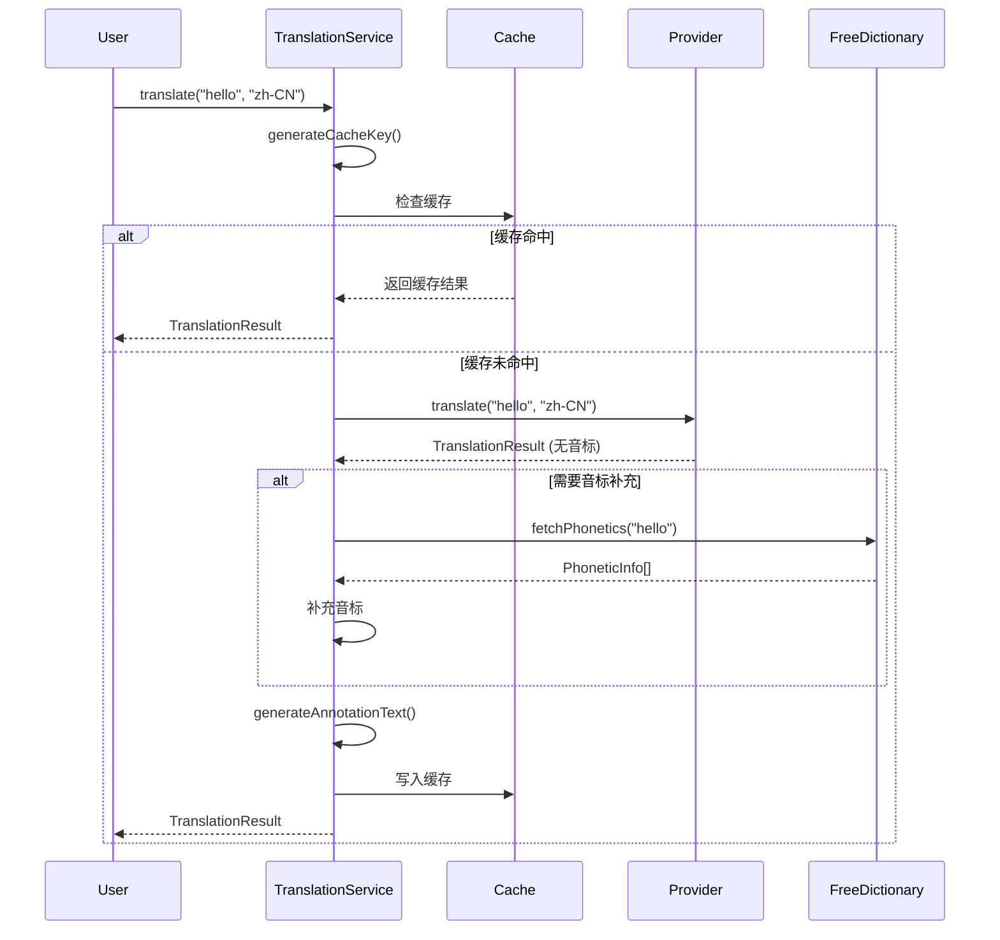
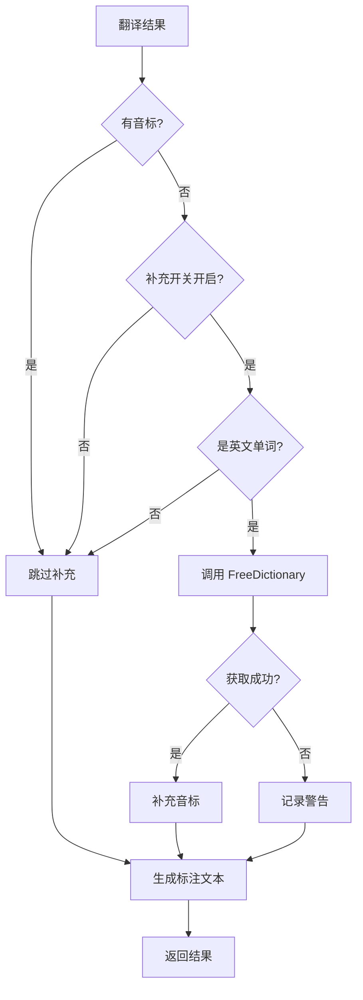

# 翻译服务层

`TranslationService` 是 Annotate Translate 的核心服务，提供统一的翻译接口，管理多个翻译提供商，实现缓存和音标补充等高级功能。

## 设计目标

### 1. 提供商抽象

通过 Provider Pattern，支持多个翻译服务，运行时可切换：

```javascript
// 支持的提供商
- Google Translate (免费，无需配置)
- Youdao (需要 API Key)
- DeepL (需要 API Key，高质量)
- OpenAI (AI 驱动，上下文感知)
- FreeDictionary (音标补充专用)
```

### 2. 缓存优化

- LRU (Least Recently Used) 缓存策略
- TTL (Time To Live) 过期时间
- 缓存键格式：`${text}:${sourceLang}:${targetLang}:${provider}`

### 3. 音标补充

三层 Fallback 机制确保音标完整性：
1. 提供商自带音标
2. FreeDictionary API 补充（英文单词）
3. 无音标

### 4. 统一数据格式

所有提供商返回统一的 `TranslationResult` 对象。

## 核心类

### TranslationProvider (抽象基类)

所有翻译提供商必须实现的接口。

```javascript
class TranslationProvider {
  constructor(name, config = {}) {
    this.name = name;
    this.config = config;
  }

  /**
   * 翻译文本
   * @param {string} text - 要翻译的文本
   * @param {string} targetLang - 目标语言（如 'zh-CN'）
   * @param {string} sourceLang - 源语言（'auto' 表示自动检测）
   * @returns {Promise<TranslationResult>}
   */
  async translate(text, targetLang, sourceLang = 'auto') {
    throw new Error('Must implement translate()');
  }

  /**
   * 检测语言
   * @param {string} text - 要检测的文本
   * @returns {Promise<string>} 语言代码
   */
  async detectLanguage(text) {
    throw new Error('Must implement detectLanguage()');
  }

  /**
   * 获取支持的语言列表
   * @returns {Array<{code: string, name: string}>}
   */
  getSupportedLanguages() {
    throw new Error('Must implement getSupportedLanguages()');
  }
}
```

### TranslationService (核心服务)

```javascript
class TranslationService {
  constructor() {
    this.providers = new Map();           // 注册的提供商
    this.activeProvider = null;           // 当前活跃提供商名称
    this.cache = new Map();                // LRU 缓存
    this.maxCacheSize = 100;               // 最大缓存条目
    this.enablePhoneticFallback = true;    // 音标补充开关
  }

  /**
   * 注册翻译提供商
   * @param {string} name - 提供商名称
   * @param {TranslationProvider} provider - 提供商实例
   */
  registerProvider(name, provider) {
    if (!(provider instanceof TranslationProvider)) {
      throw new Error('Provider must extend TranslationProvider');
    }
    this.providers.set(name, provider);
    console.log(`[TranslationService] Registered provider: ${name}`);
  }

  /**
   * 设置当前活跃提供商
   * @param {string} name - 提供商名称
   */
  setActiveProvider(name) {
    if (!this.providers.has(name)) {
      throw new Error(`Provider not found: ${name}`);
    }
    this.activeProvider = name;
    console.log(`[TranslationService] Active provider: ${name}`);
  }

  /**
   * 获取当前活跃提供商实例
   * @returns {TranslationProvider}
   */
  getActiveProvider() {
    if (!this.activeProvider) {
      throw new Error('No active provider set');
    }
    return this.providers.get(this.activeProvider);
  }

  /**
   * 翻译文本（核心方法）
   * @param {string} text - 要翻译的文本
   * @param {string} targetLang - 目标语言
   * @param {string} sourceLang - 源语言（默认 'auto'）
   * @param {Object} options - 额外选项
   * @returns {Promise<TranslationResult>}
   */
  async translate(text, targetLang, sourceLang = 'auto', options = {}) {
    // 1. 生成缓存键
    const cacheKey = this.generateCacheKey(text, sourceLang, targetLang);

    // 2. 检查缓存
    if (this.cache.has(cacheKey)) {
      const cachedResult = this.cache.get(cacheKey);
      console.log(`[TranslationService] Cache hit: ${cacheKey}`);
      return cachedResult;
    }

    // 3. 调用提供商翻译
    const provider = this.getActiveProvider();
    console.log(`[TranslationService] Translating with ${this.activeProvider}`);

    try {
      const result = await provider.translate(text, targetLang, sourceLang, options);

      // 4. 音标补充（如果需要且提供商没有返回音标）
      if (this.enablePhoneticFallback &&
          result.phonetics.length === 0 &&
          this.shouldSupplementPhonetics(text, sourceLang)) {
        await this.supplementPhoneticsFromFreeDictionary(result, text);
      }

      // 5. 生成标注文本
      result.annotationText = this.generateAnnotationText(result);

      // 6. 添加到缓存
      this.addToCache(cacheKey, result);

      // 7. 返回结果
      return result;

    } catch (error) {
      console.error(`[TranslationService] Translation failed:`, error);
      throw new TranslationError(
        error.message,
        'TRANSLATION_FAILED',
        this.activeProvider
      );
    }
  }

  /**
   * 生成缓存键
   * @private
   */
  generateCacheKey(text, sourceLang, targetLang) {
    return `${text}:${sourceLang}:${targetLang}:${this.activeProvider}`;
  }

  /**
   * 添加到缓存（LRU 策略）
   * @private
   */
  addToCache(key, value) {
    // 如果缓存满了，删除最旧的条目
    if (this.cache.size >= this.maxCacheSize) {
      const firstKey = this.cache.keys().next().value;
      this.cache.delete(firstKey);
      console.log(`[Cache] Evicted: ${firstKey}`);
    }

    // 添加新条目（Map 保持插入顺序）
    this.cache.set(key, value);
    console.log(`[Cache] Added: ${key} (size: ${this.cache.size})`);
  }

  /**
   * 判断是否需要补充音标
   * @private
   */
  shouldSupplementPhonetics(text, sourceLang) {
    // 仅对英文单词补充音标
    if (sourceLang !== 'en' && sourceLang !== 'auto') {
      return false;
    }

    // 仅对单个词补充
    if (text.split(/\s+/).length > 1) {
      return false;
    }

    // 仅对字母组成的词补充
    return /^[a-zA-Z]+$/.test(text);
  }

  /**
   * 从 FreeDictionary API 补充音标
   * @private
   */
  async supplementPhoneticsFromFreeDictionary(result, text) {
    try {
      const freeDictProvider = this.providers.get('freedict');
      if (!freeDictProvider) return;

      console.log(`[TranslationService] Supplementing phonetics for: ${text}`);

      const phoneticData = await freeDictProvider.fetchPhonetics(text);
      if (phoneticData && phoneticData.phonetics.length > 0) {
        result.phonetics = phoneticData.phonetics;
        console.log(`[TranslationService] Phonetics supplemented:`, result.phonetics);
      }
    } catch (error) {
      console.warn(`[TranslationService] Phonetic supplement failed:`, error);
      // 音标补充失败不影响翻译结果
    }
  }

  /**
   * 生成标注文本
   * 根据设置决定显示内容
   */
  generateAnnotationText(result) {
    const parts = [];

    // 从设置中读取配置
    const showPhonetics = this.config?.showPhonetics ?? true;
    const showTranslation = this.config?.showTranslation ?? true;
    const showDefinitions = this.config?.showDefinitions ?? false;

    // 1. 音标
    if (showPhonetics && result.phonetics.length > 0) {
      parts.push(result.phonetics[0].text);
    }

    // 2. 翻译
    if (showTranslation) {
      parts.push(result.translatedText);
    }

    // 3. 释义（可选）
    if (showDefinitions && result.definitions.length > 0) {
      const firstDef = result.definitions[0];
      parts.push(`${firstDef.partOfSpeech} ${firstDef.text}`);
    }

    return parts.join(' ');
  }

  /**
   * 清除缓存
   */
  clearCache() {
    this.cache.clear();
    console.log('[Cache] Cleared all entries');
  }

  /**
   * 获取缓存统计
   */
  getCacheStats() {
    return {
      size: this.cache.size,
      maxSize: this.maxCacheSize,
      keys: Array.from(this.cache.keys())
    };
  }
}

// 全局单例
const translationService = new TranslationService();
```

## 数据结构

### TranslationResult

翻译结果的统一数据结构：

```typescript
interface TranslationResult {
  // 基本信息
  originalText: string;          // 原文
  translatedText: string;        // 译文
  sourceLang: string;            // 源语言代码
  targetLang: string;            // 目标语言代码

  // 音标信息
  phonetics: PhoneticInfo[];

  // 释义
  definitions: Definition[];

  // 例句
  examples: Example[];

  // 标注文本（用于 Ruby 标注）
  annotationText: string;

  // 提供商信息
  provider: string;              // 提供商名称
  providerDisplayName?: string;  // 提供商显示名称

  // 元数据（AI 翻译专用）
  metadata?: {
    tokensUsed?: number;         // 消耗的 Token 数
    cost?: number;               // 成本（美元）
    promptTokens?: number;
    completionTokens?: number;
  };

  // 时间戳
  timestamp: number;             // Unix 时间戳
}
```

### PhoneticInfo

```typescript
interface PhoneticInfo {
  text: string;           // 音标文本，如 "/həˈloʊ/"
  type: 'us' | 'uk' | 'ipa' | 'pinyin' | 'default';
  audioUrl?: string;      // 音频 URL
  audioData?: ArrayBuffer; // 音频数据（可选）
}
```

### Definition

```typescript
interface Definition {
  partOfSpeech: string;   // 词性：n., v., adj., adv. 等
  text: string;           // 释义文本
  synonyms?: string[];    // 同义词（可选）
}
```

### Example

```typescript
interface Example {
  source: string;         // 原文（可能包含 HTML）
  translation: string;    // 译文
}
```

## 使用示例

### 基本用法

```javascript
// 1. 注册提供商
translationService.registerProvider('google', new GoogleTranslateProvider());
translationService.registerProvider('youdao', new YoudaoTranslateProvider(config));
translationService.registerProvider('freedict', new FreeDictionaryProvider());

// 2. 设置当前提供商
translationService.setActiveProvider('google');

// 3. 翻译
const result = await translationService.translate('hello', 'zh-CN', 'auto');

console.log(result.translatedText); // "你好"
console.log(result.phonetics[0].text); // "/həˈloʊ/"
console.log(result.definitions[0].text); // "(用于问候)喂，你好"
```

### 切换提供商

```javascript
// 切换到 Youdao
translationService.setActiveProvider('youdao');

// 再次翻译（会使用 Youdao）
const result = await translationService.translate('hello', 'zh-CN');
```

### 自定义配置

```javascript
// 配置音标和标注选项
translationService.config = {
  showPhonetics: true,
  showTranslation: true,
  showDefinitions: true
};

translationService.enablePhoneticFallback = true;
translationService.maxCacheSize = 200;
```

### 缓存管理

```javascript
// 查看缓存统计
const stats = translationService.getCacheStats();
console.log(`Cache size: ${stats.size}/${stats.maxSize}`);

// 清除缓存
translationService.clearCache();
```

## 工作流程

### 翻译流程图



### 音标补充逻辑



## 缓存策略详解

### LRU 缓存实现

```javascript
addToCache(key, value) {
  // 1. 检查缓存大小
  if (this.cache.size >= this.maxCacheSize) {
    // 2. 删除最旧的条目（Map 的第一个 key）
    const firstKey = this.cache.keys().next().value;
    this.cache.delete(firstKey);
  }

  // 3. 添加新条目（自动添加到末尾）
  this.cache.set(key, value);
}

// 访问时的 LRU 更新
get(key) {
  if (this.cache.has(key)) {
    const value = this.cache.get(key);
    // 删除并重新添加，移到末尾
    this.cache.delete(key);
    this.cache.set(key, value);
    return value;
  }
  return null;
}
```

### 缓存键设计

```javascript
// 缓存键格式
const cacheKey = `${text}:${sourceLang}:${targetLang}:${provider}`;

// 示例
"hello:auto:zh-CN:google"
"world:en:zh-CN:youdao"
"chamber:en:zh-CN:openai"  // 上下文翻译也会缓存
```

**为什么包含 Provider？**
- 不同提供商翻译结果可能不同
- 切换提供商时需要重新翻译
- 避免混淆不同来源的数据

## 错误处理

### TranslationError

```javascript
class TranslationError extends Error {
  constructor(message, code, provider) {
    super(message);
    this.name = 'TranslationError';
    this.code = code;
    this.provider = provider;
  }
}

// 错误代码
const ErrorCodes = {
  NETWORK_ERROR: 'NETWORK_ERROR',
  API_KEY_INVALID: 'API_KEY_INVALID',
  RATE_LIMIT_EXCEEDED: 'RATE_LIMIT_EXCEEDED',
  PROVIDER_NOT_FOUND: 'PROVIDER_NOT_FOUND',
  TRANSLATION_FAILED: 'TRANSLATION_FAILED'
};
```

### 使用示例

```javascript
try {
  const result = await translationService.translate('hello', 'zh-CN');
} catch (error) {
  if (error instanceof TranslationError) {
    console.error(`Provider ${error.provider} failed: ${error.code}`);
    console.error(error.message);

    // 根据错误代码处理
    if (error.code === 'API_KEY_INVALID') {
      alert('API Key 无效，请检查设置');
    }
  }
}
```

## 性能优化

### 1. 缓存命中率

```javascript
let cacheHits = 0;
let cacheMisses = 0;

async translate(text, targetLang, sourceLang) {
  const cacheKey = this.generateCacheKey(...);

  if (this.cache.has(cacheKey)) {
    cacheHits++;
    console.log(`Cache hit rate: ${(cacheHits / (cacheHits + cacheMisses) * 100).toFixed(2)}%`);
    return this.cache.get(cacheKey);
  }

  cacheMisses++;
  // 继续翻译...
}
```

### 2. 批量翻译

```javascript
async translateBatch(words, targetLang, options = {}) {
  const concurrency = options.concurrency || 3;
  const delay = options.delay || 1000;
  const results = [];

  for (let i = 0; i < words.length; i += concurrency) {
    const batch = words.slice(i, i + concurrency);

    // 并发翻译
    const batchResults = await Promise.all(
      batch.map(word =>
        this.translate(word, targetLang).catch(e => null)
      )
    );

    results.push(...batchResults);

    // 延迟避免速率限制
    if (i + concurrency < words.length) {
      await new Promise(r => setTimeout(r, delay));
    }
  }

  return results;
}
```

### 3. 请求去重

```javascript
// 防止相同请求同时进行
constructor() {
  // ...
  this.pendingRequests = new Map();
}

async translate(text, targetLang, sourceLang) {
  const cacheKey = this.generateCacheKey(...);

  // 如果已经在翻译中，返回相同的 Promise
  if (this.pendingRequests.has(cacheKey)) {
    console.log(`[TranslationService] Request already pending: ${cacheKey}`);
    return this.pendingRequests.get(cacheKey);
  }

  // 创建新的翻译 Promise
  const promise = this._doTranslate(text, targetLang, sourceLang);

  // 记录 pending 请求
  this.pendingRequests.set(cacheKey, promise);

  try {
    const result = await promise;
    return result;
  } finally {
    // 完成后移除 pending 记录
    this.pendingRequests.delete(cacheKey);
  }
}
```

## 扩展性

### 添加新提供商

只需实现 `TranslationProvider` 接口并注册：

```javascript
class MyCustomProvider extends TranslationProvider {
  async translate(text, targetLang, sourceLang) {
    // 实现翻译逻辑
    return {
      originalText: text,
      translatedText: '...',
      sourceLang: 'en',
      targetLang: targetLang,
      phonetics: [],
      definitions: [],
      examples: [],
      provider: 'mycustom',
      timestamp: Date.now()
    };
  }

  async detectLanguage(text) {
    // 实现语言检测
    return 'en';
  }

  getSupportedLanguages() {
    return [
      { code: 'en', name: 'English' },
      { code: 'zh-CN', name: '简体中文' }
    ];
  }
}

// 注册
translationService.registerProvider('mycustom', new MyCustomProvider());
```

[完整教程 →](/recipes/add-new-provider)

## 总结

`TranslationService` 的设计体现了以下原则：

- **单一职责** - 专注于翻译服务管理
- **开闭原则** - 对扩展开放（新提供商），对修改关闭
- **依赖倒置** - 依赖抽象（TranslationProvider），不依赖具体实现
- **关注点分离** - 缓存、音标补充、数据格式化分离
- **性能优先** - LRU 缓存、请求去重、批量操作

## 相关文档

- [提供商系统](/development/providers) - 详细了解各个提供商
- [TranslationService API](/api/translation-service) - 完整 API 参考
- [添加新提供商](/recipes/add-new-provider) - 实战教程
- [架构概览](/development/architecture) - 系统整体设计
