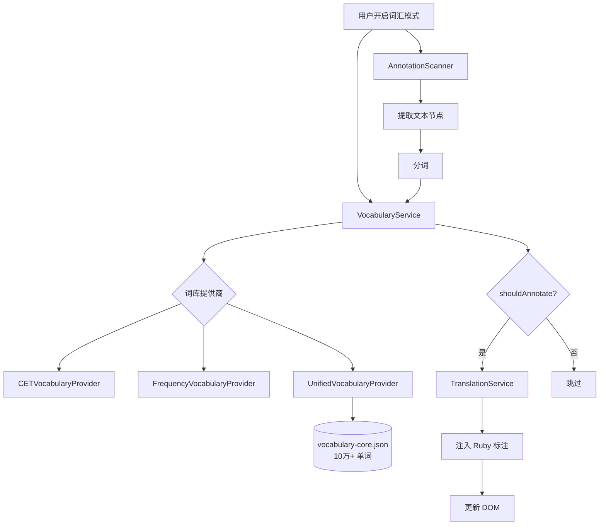

# 词库系统

词库系统是 Annotate Translate 的高级特性，支持根据词库自动标注页面中的重点词汇，适用于英语学习场景。

## 功能概述

- ✅ **多个标准词库** - CET-4/6、TOEFL、IELTS、GRE、考研
- ✅ **批量扫描标注** - 自动扫描页面并标注词库中的单词
- ✅ **灵活过滤** - 按词库标签、Collins 星级、词频过滤
- ✅ **中断支持** - 可随时中止扫描任务
- ✅ **性能优化** - 缓存、批量操作、并发控制

## 架构



## 核心组件

### 1. VocabularyService

词库服务管理器，负责词库查询和批量检查。

```javascript
class VocabularyService {
  constructor() {
    this.providers = new Map();      // 注册的词库提供商
    this.activeProvider = null;      // 当前活跃提供商
    this.activeOptions = null;       // 当前配置选项
    this.cache = new Map();          // 查询缓存
    this.maxCacheSize = 1000;
  }

  /**
   * 设置当前词库提供商
   */
  async setActiveProvider(name, options) {
    if (!this.providers.has(name)) {
      throw new Error(`Vocabulary provider not found: ${name}`);
    }

    const provider = this.providers.get(name);

    // 初始化提供商（加载词库数据）
    if (!provider.initialized) {
      await provider.initialize();
    }

    this.activeProvider = provider;
    this.activeOptions = options;

    console.log(`[VocabularyService] Active provider: ${name}`, options);
  }

  /**
   * 判断单词是否应该标注
   * @param {string} word - 要检查的单词
   * @param {Object} context - 上下文信息（可选）
   * @returns {boolean}
   */
  shouldAnnotate(word, context = {}) {
    if (!this.activeProvider) {
      return false;
    }

    // 规范化单词
    const normalized = this.activeProvider.normalizeWord(word);

    // 检查缓存
    const cacheKey = `${normalized}:${JSON.stringify(this.activeOptions)}`;
    if (this.cache.has(cacheKey)) {
      return this.cache.get(cacheKey);
    }

    // 查询提供商
    const result = this.activeProvider.shouldAnnotate(
      normalized,
      this.activeOptions,
      context
    );

    // 写入缓存
    this.addToCache(cacheKey, result);

    return result;
  }

  /**
   * 批量检查单词
   * @param {string[]} words - 单词列表
   * @returns {Map<string, boolean>}
   */
  batchCheck(words) {
    const results = new Map();

    for (const word of words) {
      results.set(word, this.shouldAnnotate(word));
    }

    return results;
  }

  /**
   * 获取单词详细信息
   */
  getWordInfo(word) {
    if (!this.activeProvider) {
      return null;
    }

    const normalized = this.activeProvider.normalizeWord(word);
    return this.activeProvider.getWordInfo(normalized);
  }

  /**
   * 添加到缓存（LRU）
   */
  addToCache(key, value) {
    if (this.cache.size >= this.maxCacheSize) {
      const firstKey = this.cache.keys().next().value;
      this.cache.delete(firstKey);
    }
    this.cache.set(key, value);
  }

  /**
   * 清除缓存
   */
  clearCache() {
    this.cache.clear();
  }
}

// 全局单例
const vocabularyService = new VocabularyService();
```

### 2. VocabularyProvider (抽象基类)

```javascript
class BaseVocabularyProvider {
  constructor(name) {
    this.name = name;
    this.initialized = false;
    this.vocabulary = new Map();
  }

  /**
   * 初始化（加载词库数据）
   */
  async initialize() {
    throw new Error('Must implement initialize()');
  }

  /**
   * 判断单词是否应该标注
   */
  shouldAnnotate(word, options, context) {
    throw new Error('Must implement shouldAnnotate()');
  }

  /**
   * 规范化单词
   */
  normalizeWord(word) {
    return word.toLowerCase().trim();
  }

  /**
   * 获取单词详细信息
   */
  getWordInfo(word) {
    return this.vocabulary.get(word) || null;
  }
}
```

### 3. UnifiedVocabularyProvider

**推荐使用的提供商**，整合了所有词库数据。

```javascript
class UnifiedVocabularyProvider extends BaseVocabularyProvider {
  constructor() {
    super('unified');
  }

  /**
   * 初始化 - 加载词库数据
   */
  async initialize() {
    if (this.initialized) return;

    try {
      // 加载核心词库数据
      const url = chrome.runtime.getURL('src/data/vocabularies/vocabulary-core.json');
      const response = await fetch(url);
      const data = await response.json();

      // 转换为 Map 格式
      this.vocabulary = new Map(Object.entries(data.words || data));
      this.meta = data.meta || {};

      this.initialized = true;
      console.log(`[UnifiedVocabularyProvider] Loaded ${this.vocabulary.size} words`);

    } catch (error) {
      console.error('[UnifiedVocabularyProvider] Failed to load:', error);
      throw error;
    }
  }

  /**
   * 判断单词是否应该标注
   */
  shouldAnnotate(word, options, context = {}) {
    const entry = this.vocabulary.get(word);
    if (!entry) return false;

    const {
      targetTags = [],      // 目标词库标签，如 ['cet4', 'cet6']
      minCollins = 0,       // 最低 Collins 星级
      maxCollins = 5,       // 最高 Collins 星级
      minFrequency = 0,     // 最低词频
      excludeKnown = false  // 排除已知单词（未实现）
    } = options;

    // 1. 检查词库标签
    if (targetTags.length > 0) {
      const hasTag = targetTags.some(tag => entry.tags?.includes(tag));
      if (!hasTag) return false;
    }

    // 2. 检查 Collins 星级
    const collins = entry.collins || 0;
    if (collins < minCollins || collins > maxCollins) {
      return false;
    }

    // 3. 检查词频
    const frequency = entry.frequency || 0;
    if (frequency < minFrequency) {
      return false;
    }

    // 4. 其他条件...

    return true;
  }

  /**
   * 获取单词详细信息
   */
  getWordInfo(word) {
    const entry = this.vocabulary.get(word);
    if (!entry) return null;

    return {
      word,
      tags: entry.tags || [],
      collins: entry.collins || 0,
      frequency: entry.frequency || 0,
      level: this.getLevel(entry)
    };
  }

  /**
   * 获取单词难度等级
   */
  getLevel(entry) {
    if (entry.tags?.includes('cet4')) return 'CET-4';
    if (entry.tags?.includes('cet6')) return 'CET-6';
    if (entry.tags?.includes('toefl')) return 'TOEFL';
    if (entry.tags?.includes('ielts')) return 'IELTS';
    if (entry.tags?.includes('gre')) return 'GRE';
    return 'Unknown';
  }
}
```

### 4. AnnotationScanner

页面扫描器，负责提取文本、分词、标注。

```javascript
class AnnotationScanner {
  constructor(vocabularyService, translationService) {
    this.vocabularyService = vocabularyService;
    this.translationService = translationService;
    this.abortController = null;
    this.isScanning = false;
  }

  /**
   * 扫描并标注页面
   */
  async scanAndAnnotate(rootElement, options = {}) {
    if (this.isScanning) {
      console.warn('[AnnotationScanner] Already scanning');
      return;
    }

    this.isScanning = true;
    this.abortController = new AbortController();

    const {
      concurrency = 3,      // 并发翻译数
      delay = 500,          // 翻译间隔（ms）
      maxWords = 100        // 最多标注单词数
    } = options;

    try {
      // 1. 提取文本节点
      console.log('[AnnotationScanner] Extracting text nodes...');
      const textNodes = this.extractTextNodes(rootElement);
      console.log(`[AnnotationScanner] Found ${textNodes.length} text nodes`);

      // 2. 分词
      console.log('[AnnotationScanner] Tokenizing...');
      const words = this.extractWords(textNodes);
      console.log(`[AnnotationScanner] Extracted ${words.size} unique words`);

      // 3. 过滤 - 批量检查哪些词需要标注
      console.log('[AnnotationScanner] Filtering with vocabulary...');
      const toAnnotate = new Map();

      for (const [word, positions] of words.entries()) {
        if (toAnnotate.size >= maxWords) break;

        if (this.vocabularyService.shouldAnnotate(word)) {
          toAnnotate.set(word, positions);
        }
      }

      console.log(`[AnnotationScanner] ${toAnnotate.size} words to annotate`);

      // 4. 批量翻译和标注
      await this.batchTranslateAndAnnotate(toAnnotate, {
        concurrency,
        delay
      });

      console.log('[AnnotationScanner] Scan complete');

    } catch (error) {
      if (error.name === 'AbortError') {
        console.log('[AnnotationScanner] Scan aborted');
      } else {
        console.error('[AnnotationScanner] Scan failed:', error);
      }
    } finally {
      this.isScanning = false;
      this.abortController = null;
    }
  }

  /**
   * 提取文本节点
   */
  extractTextNodes(rootElement) {
    const textNodes = [];
    const walker = document.createTreeWalker(
      rootElement,
      NodeFilter.SHOW_TEXT,
      {
        acceptNode: (node) => {
          // 跳过脚本、样式等
          const parent = node.parentElement;
          if (!parent) return NodeFilter.FILTER_REJECT;

          const tagName = parent.tagName.toLowerCase();
          if (['script', 'style', 'noscript', 'iframe'].includes(tagName)) {
            return NodeFilter.FILTER_REJECT;
          }

          // 跳过已标注的
          if (parent.tagName === 'RUBY' || parent.closest('ruby')) {
            return NodeFilter.FILTER_REJECT;
          }

          // 跳过空白文本
          if (node.textContent.trim().length === 0) {
            return NodeFilter.FILTER_REJECT;
          }

          return NodeFilter.FILTER_ACCEPT;
        }
      }
    );

    let node;
    while (node = walker.nextNode()) {
      textNodes.push(node);
    }

    return textNodes;
  }

  /**
   * 分词
   */
  extractWords(textNodes) {
    const words = new Map(); // Map<word, positions[]>

    for (const node of textNodes) {
      const text = node.textContent;
      const regex = /\b[a-zA-Z]{2,}\b/g; // 匹配英文单词（2个字母以上）

      let match;
      while ((match = regex.exec(text)) !== null) {
        const word = match[0].toLowerCase();

        if (!words.has(word)) {
          words.set(word, []);
        }

        words.get(word).push({
          node,
          startOffset: match.index,
          endOffset: match.index + match[0].length,
          originalWord: match[0]
        });
      }
    }

    return words;
  }

  /**
   * 批量翻译和标注
   */
  async batchTranslateAndAnnotate(words, options = {}) {
    const { concurrency = 3, delay = 500 } = options;
    const wordList = Array.from(words.keys());

    for (let i = 0; i < wordList.length; i += concurrency) {
      // 检查中断信号
      if (this.abortController.signal.aborted) {
        throw new DOMException('Scan aborted', 'AbortError');
      }

      // 取一批单词
      const batch = wordList.slice(i, i + concurrency);

      // 并发翻译
      const results = await Promise.all(
        batch.map(word =>
          this.translationService.translate(word, 'zh-CN', 'en')
            .catch(error => {
              console.error(`[AnnotationScanner] Failed to translate "${word}":`, error);
              return null;
            })
        )
      );

      // 标注
      for (let j = 0; j < batch.length; j++) {
        const word = batch[j];
        const result = results[j];

        if (result) {
          this.annotateWord(word, words.get(word), result);
        }
      }

      // 延迟避免速率限制
      if (i + concurrency < wordList.length) {
        await new Promise(r => setTimeout(r, delay));
      }
    }
  }

  /**
   * 标注单词
   */
  annotateWord(word, positions, translationResult) {
    for (const pos of positions) {
      try {
        const { node, startOffset, endOffset, originalWord } = pos;

        // 创建 Ruby 元素
        const ruby = document.createElement('ruby');
        ruby.textContent = originalWord;
        ruby.className = 'vocab-annotation';

        const rt = document.createElement('rt');
        rt.textContent = translationResult.annotationText;
        ruby.appendChild(rt);

        // 替换文本节点
        const text = node.textContent;
        const before = text.substring(0, startOffset);
        const after = text.substring(endOffset);

        const parent = node.parentElement;
        const beforeNode = document.createTextNode(before);
        const afterNode = document.createTextNode(after);

        parent.insertBefore(beforeNode, node);
        parent.insertBefore(ruby, node);
        parent.insertBefore(afterNode, node);
        parent.removeChild(node);

        // 只处理第一个出现的位置
        break;

      } catch (error) {
        console.error('[AnnotationScanner] Failed to annotate:', error);
      }
    }
  }

  /**
   * 中止扫描
   */
  abort() {
    if (this.abortController && this.isScanning) {
      this.abortController.abort();
      return true;
    }
    return false;
  }

  /**
   * 检查是否正在扫描
   */
  isScanningNow() {
    return this.isScanning;
  }
}
```

## 数据结构

### 词库数据格式

```json
{
  "meta": {
    "version": "1.0.0",
    "totalWords": 100000,
    "source": "ECDICT",
    "license": "MIT"
  },
  "words": {
    "abandon": {
      "tags": ["cet4", "cet6", "toefl", "ielts"],
      "collins": 4,
      "frequency": 5234,
      "bnc": 3456,
      "frq": 2345
    },
    "chamber": {
      "tags": ["cet6", "toefl", "ielts", "gre"],
      "collins": 5,
      "frequency": 8901
    }
  }
}
```

**字段说明**:
- `tags` - 词库标签数组
- `collins` - Collins 词典星级 (1-5)
- `frequency` - 词频（数字越大越常用）
- `bnc` - BNC 语料库词频
- `frq` - 综合词频

## 使用示例

### 基本用法

```javascript
// 1. 初始化词库提供商
const unifiedProvider = new UnifiedVocabularyProvider();
await vocabularyService.registerProvider('unified', unifiedProvider);

// 2. 设置当前提供商和选项
await vocabularyService.setActiveProvider('unified', {
  targetTags: ['cet4', 'cet6'],  // 只标注 CET-4/6 词汇
  minCollins: 2,                  // Collins 星级 >= 2
  minFrequency: 1000              // 词频 >= 1000
});

// 3. 创建扫描器
const scanner = new AnnotationScanner(
  vocabularyService,
  translationService
);

// 4. 扫描并标注整个页面
await scanner.scanAndAnnotate(document.body, {
  concurrency: 3,    // 并发翻译 3 个单词
  delay: 500,        // 每批间隔 500ms
  maxWords: 50       // 最多标注 50 个单词
});
```

### 检查单个单词

```javascript
// 设置词库
await vocabularyService.setActiveProvider('unified', {
  targetTags: ['toefl', 'ielts']
});

// 检查单词
const shouldAnnotate = vocabularyService.shouldAnnotate('abandon');
console.log(shouldAnnotate); // true（如果在 TOEFL/IELTS 词库中）

// 获取单词信息
const info = vocabularyService.getWordInfo('abandon');
console.log(info);
// {
//   word: 'abandon',
//   tags: ['cet4', 'cet6', 'toefl', 'ielts'],
//   collins: 4,
//   frequency: 5234,
//   level: 'CET-4'
// }
```

### 批量检查

```javascript
const words = ['hello', 'abandon', 'chamber', 'world'];
const results = vocabularyService.batchCheck(words);

for (const [word, shouldAnnotate] of results.entries()) {
  console.log(`${word}: ${shouldAnnotate}`);
}
```

### 中断扫描

```javascript
// 开始扫描
scanner.scanAndAnnotate(document.body);

// 用户点击"停止"按钮
document.getElementById('stop-scan').addEventListener('click', () => {
  if (scanner.abort()) {
    console.log('Scan aborted');
  }
});
```

## 性能优化

### 1. 缓存策略

```javascript
// VocabularyService 使用 LRU 缓存
// 缓存键: `${word}:${JSON.stringify(options)}`

// 示例
"abandon:{\"targetTags\":[\"cet4\"]}" -> true
"hello:{\"targetTags\":[\"cet6\"]}" -> false
```

### 2. 批量操作

```javascript
// 一次性检查多个单词
const words = ['word1', 'word2', 'word3'];
const results = vocabularyService.batchCheck(words);

// 而非
// for (const word of words) {
//   vocabularyService.shouldAnnotate(word); // 低效
// }
```

### 3. 并发控制

```javascript
// 控制并发翻译数，避免速率限制
await scanner.scanAndAnnotate(document.body, {
  concurrency: 3,    // 每次最多 3 个并发请求
  delay: 500         // 每批间隔 500ms
});
```

### 4. 限制标注数量

```javascript
// 避免标注过多单词影响阅读
await scanner.scanAndAnnotate(document.body, {
  maxWords: 50  // 最多标注 50 个单词
});
```

## 扩展性

### 添加自定义词库

```javascript
class CustomVocabularyProvider extends BaseVocabularyProvider {
  constructor() {
    super('custom');
  }

  async initialize() {
    // 加载自定义词库数据
    const data = await loadCustomData();
    this.vocabulary = new Map(data);
    this.initialized = true;
  }

  shouldAnnotate(word, options) {
    // 自定义过滤逻辑
    return this.vocabulary.has(word);
  }
}

// 注册
vocabularyService.registerProvider('custom', new CustomVocabularyProvider());
```

[完整教程 →](/recipes/custom-vocabulary)

## 总结

词库系统的特点：

- **灵活过滤** - 多维度条件（标签、星级、词频）
- **高性能** - 缓存、批量操作、并发控制
- **可中断** - AbortController 支持
- **易扩展** - 自定义词库提供商

## 相关文档

- [AnnotationScanner API](/api/annotation-scanner)
- [VocabularyService API](/api/vocabulary-service)
- [自定义词库](/recipes/custom-vocabulary)
- [ECDICT 数据源](/resources/ecdict)
