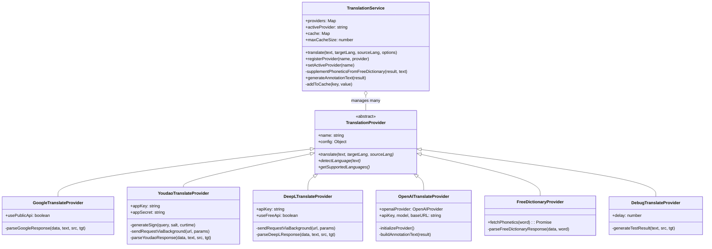

<!-- DD-DOC
Living documentation for the translation-service module.
- Agent: read this doc before modifying any code in this module. Understand current architecture before making changes.
- Engineer: this doc reflects the current system state. If code differs from this doc, one of them needs updating.
-->

# Translation Service

::: tip TL;DR
Core abstraction layer that manages multiple translation providers (Google, Youdao, DeepL, OpenAI, FreeDictionary) behind a unified interface. Implements LRU caching, automatic phonetic fallback via FreeDictionary for single English words, and configurable annotation text generation. Exposed as a global singleton `translationService` with Google Translate as the default active provider.
:::

## 代码映射

| 职责 | 文件路径 |
|------|----------|
| Provider 基类 + 所有内置 Provider + 服务管理器 | `src/services/translation-service.js` |
| OpenAI 底层 Provider 实现 | `src/providers/openai-provider.js` |
| AI 翻译服务（高级封装） | `src/services/ai-translation-service.js` |
| 背景脚本 CORS 代理 | `src/background/background.js` |
| 翻译卡片 UI 渲染 | `src/content/translation-ui.js` |
| 设置 Schema 定义 | `src/utils/settings-schema.js` |

## 架构概览



## 核心接口

### TranslationProvider (abstract base)

```js
constructor(name: string, config?: Object)
async translate(text: string, targetLang: string, sourceLang?: string): Promise<TranslationResult>
async detectLanguage(text: string): Promise<string>
async getSupportedLanguages(): Promise<Array<{code, name}>>
```

Throws `TypeError` if instantiated directly.

### TranslationService (manager/singleton)

```js
registerProvider(name: string, provider: TranslationProvider): void
setActiveProvider(name: string): void
getActiveProvider(): TranslationProvider
async translate(text: string, targetLang: string, sourceLang?: string, options?: Object): Promise<TranslationResult>
generateAnnotationText(result: TranslationResult): string
enableCache(size?: number): void   // clamps to 10-1000
disableCache(): void
clearCache(): void
```

### TranslationResult (typedef)

```js
{ originalText, translatedText, sourceLang, targetLang,
  phonetics: PhoneticInfo[], definitions: Definition[], examples: Example[],
  annotationText?: string, provider: string, timestamp: number }
```

## 业务逻辑

### 缓存策略

- **类型**: FIFO 淘汰（基于 `Map` 插入顺序），接近 LRU 行为
- **Key 格式**: `${text}:${sourceLang}:${targetLang}:${activeProvider}`
- **默认容量**: 100 条，可通过 `enableCache(size)` 调整（10-1000）
- **绕过缓存**: 传入 `options.noCache = true`
- **切换 Provider**: Provider 名称编入 cache key，因此切换 Provider 后旧缓存自然不命中

### 音标补充链

1. 活动 Provider 返回 `result.phonetics`
2. 若 `phonetics` 为空 **且** `enablePhoneticFallback === true`:
   - 检查原文是否为单个英文单词（`/^[a-zA-Z]+$/`）
   - 调用 `FreeDictionaryProvider.fetchPhonetics(word)` 补充
3. 补充后重新生成 `annotationText`

### 标注文本生成

`generateAnnotationText(result)` 按配置拼接三部分（空格分隔）:
1. 音标（`showPhoneticInAnnotation`）-- 优先 US > default > first
2. 翻译（`showTranslationInAnnotation`）
3. 释义（`showDefinitionsInAnnotation`）-- 最多 2 条

兜底: 若所有部分为空，返回 `translatedText`。

### CORS 代理

Youdao 和 DeepL 的请求通过 `chrome.runtime.sendMessage` 发往 background script，由 background 代理 fetch 绕过内容脚本的 CORS 限制。Google 和 FreeDictionary 直接从内容脚本 fetch。

## 设计决策

| 决策 | 理由 |
|------|------|
| 音标补充由 `TranslationService` 统一处理，而非各 Provider 内部 | 避免重复逻辑；各 Provider 注释明确标注 "移除提供者级别的音标补充" |
| `FreeDictionaryProvider` 不实现 `translate()` | 仅用于音标查询，调用 `translate()` 直接抛异常 |
| `OpenAITranslateProvider` 使用适配器模式包装 `OpenAIProvider` | 解耦 AI SDK 与 TranslationProvider 接口，支持延迟初始化 |
| DeepL 根据 key 后缀 `:fx` 自动检测免费/付费 API | 减少用户配置错误 |
| Cache key 包含 provider 名称 | 不同 Provider 对同一文本可能返回不同结果 |
| 全局 singleton `translationService` | 整个扩展共享一个实例，简化状态管理 |

## 已知限制

- 缓存为 FIFO 淘汰，非严格 LRU（不会在命中时提升优先级）
- FreeDictionary 补充仅支持纯英文单词（不支持短语或含连字符单词）
- Youdao 翻译 API 可能不返回音标（只有词典 API 才有），需依赖 FreeDictionary 补充
- DeepL 不提供音标、词义、例句，完全依赖后处理补充
- `DebugTranslateProvider` 仅包含 `hello`/`apple`/`world` 三个预置词条
- OpenAI Provider 依赖外部 `OpenAIProvider` 类，若未加载则注册失败（静默降级）

## 变更历史

| 提交 | 说明 |
|------|------|
| `7fa0016` | feat: add token usage statistics for AI providers |
| `9e03beb` | feat: add AI provider management, support multiple OpenAI-compatible services |
| `d55ac90` | feat: add annotation settings (show translation/definitions toggles) |
| `c1ad5fb` | feat: add options parameter to translate(), enhance provider call flexibility |
| `96a67f3` | feat: add extra options support to OpenAI provider for context passing |
| `d3d0c1f` | refactor: reorganize project structure |
